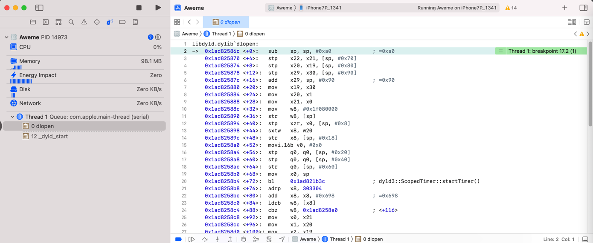
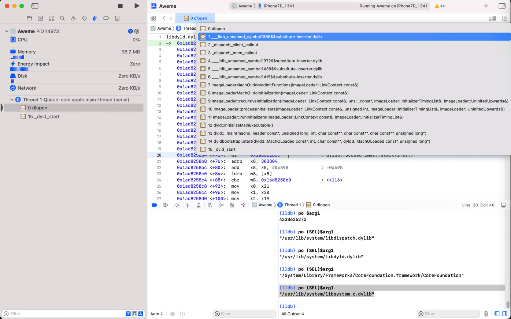

# dlopen

* 所属头文件: `dlfcn.h`
* 语法定义
  ```c
  void* dlopen(const char* path, int mode);
  ```

## man page

```bash
DLOPEN(3)                BSD Library Functions Manual                DLOPEN(3)

NAME
     dlopen -- load and link a dynamic library or bundle

SYNOPSIS
     #include <dlfcn.h>

     void*
     dlopen(const char* path, int mode);

DESCRIPTION
     dlopen() examines the mach-o file specified by path.  If the file is com-patible compatible
     patible with the current process and has not already been loaded into the
     current process, it is loaded and linked.  After being linked, if it con-tains contains
     tains any initializer functions, they are called, before dlopen()
     returns.  dlopen() can load dynamic libraries and bundles.  It returns a
     handle that can be used with dlsym() and dlclose().  A second call to
     dlopen() with the same path will return the same handle, but the internal
     reference count for the handle will be incremented.  Therefore all
     dlopen() calls should be balanced with a dlclose() call.

     If a null pointer is passed in path, dlopen() returns a handle equivalent
     to RTLD_DEFAULT.

     mode contains options to dlopen().  It must contain one or more of the
     following values, possibly ORed together:

     RTLD_LAZY   Each external function reference is bound the first time the
                 function is called.

     RTLD_NOW    All external function references are bound immediately during
                 the call to dlopen().

     RTLD_LAZY is normally preferred, for reasons of efficiency.  However,
     RTLD_NOW is useful to ensure that any undefined symbols are discovered
     during the call to dlopen().  If neither RTLD_LAZY nor RTLD_NOW is speci-fied, specified,
     fied, the default is RTLD_LAZY.

     One of the following flags may be ORed into the mode argument:

     RTLD_GLOBAL  Symbols exported from this image (dynamic library or bundle)
                  will be available to any images build with -flat_namespace
                  option to ld(1) or to calls to dlsym() when using a special
                  handle.

     RTLD_LOCAL   Symbols exported from this image (dynamic library or bundle)
                  are generally hidden and only availble to dlsym() when
                  directly using the handle returned by this call to dlopen().

     If neither RTLD_GLOBAL nor RTLD_LOCAL is specified, the default is
     RTLD_GLOBAL.

     One of the following may be ORed into the mode argument:

     RTLD_NOLOAD     The specified image is not loaded.  However, a valid
                     handle is returned if the image already exists in the
                     process. This provides a way to query if an image is
                     already loaded.  The handle returned is ref-counted, so
                     you eventually need a corresponding call to dlclose()

     RTLD_NODELETE   The specified image is tagged so that will never be
                     removed from the address space, even after all clients
                     have released it via dlclose()

     Additionally, the following may be ORed into the mode argument:

     RTLD_FIRST   The retuned handle is tagged so that any dlsym() calls on
                  the handle will only search the image specified, and not
                  subsequent images.  If path is NULL and the option
                  RTLD_FIRST is used, the handle returned will only search the
                  main executable.

SEARCHING
     dlopen() searches for a compatible Mach-O file in the directories speci-fied specified
     fied by a set of environment variables and the process's current working
     directory.  When set, the environment variables must contain a colon-sep-arated colon-separated
     arated list of directory paths, which can be absolute or relative to the
     current working directory. The environment variables are LD_LIBRARY_PATH,
     DYLD_LIBRARY_PATH, and DYLD_FALLBACK_LIBRARY_PATH.  The first two vari-ables variables
     ables have no default value. The default value of DYLD_FALL-BACK_LIBRARY_PATH DYLD_FALLBACK_LIBRARY_PATH
     BACK_LIBRARY_PATH is $HOME/lib;/usr/local/lib;/usr/lib.  dlopen()
     searches the directories specified in the environment variables in the
     order they are listed.

     When path doesn't contain a slash character (i.e. it is just a leaf
     name), dlopen() searches the following the following until it finds a
     compatible Mach-O file: $LD_LIBRARY_PATH, $DYLD_LIBRARY_PATH, current
     working directory, $DYLD_FALLBACK_LIBRARY_PATH.

     When path contains a slash (i.e. a full path or a partial path) dlopen()
     searches the following the following until it finds a compatible Mach-O
     file: $DYLD_LIBRARY_PATH (with leaf name from path ), current working
     directory (for partial paths), $DYLD_FALLBACK_LIBRARY_PATH (with leaf
     name from path ).

     Note: There are no configuration files to control dlopen searching.

     Note: If the main executable is a set[ug]id binary, then all environment
     variables are ignored, and only a full path can be used.

     Note: Mac OS X uses "universal" files to combine 32-bit and 64-bit
     libraries.  This means there are no separate 32-bit and 64-bit search
     paths.

RETURN VALUES
     If dlopen() fails, it returns a null pointer, and sets an error condition
     which may be interrogated with dlerror().

AUTHORS
     Mac OS X 10.3 incorporated the dlcompat package written by Jorge Acereda
     <jacereda@users.sourceforge.net> and Peter O'Gorman <ogor-
     man@users.sourceforge.net>.

     In Mac OS X 10.4, dlopen was rewritten to be a native part of dyld.

SEE ALSO
     dlopen_preflight(3) dlclose(3) dlsym(3) dlerror(3) dyld(3) ld(1)

BSD                               Nov 6, 2006                              BSD
```

## dlopen逆向调试

### Xcode中反汇编代码




调试时相关内容：

```bash
(lldb) p $arg1
(unsigned long) $4 = 4338636176
(lldb) p (SEL)$arg1
(SEL) $5 = "/usr/lib/system/libdyld.dylib"
```

后续多次触发时参数：

```bash
(lldb) po (SEL)$arg1
"/usr/lib/system/libdispatch.dylib"

(lldb) po (SEL)$arg1
"/usr/lib/system/libdyld.dylib"

(lldb) po (SEL)$arg1
"/System/Library/Frameworks/CoreFoundation.framework/CoreFoundation"

(lldb) po (SEL)$arg1
"/usr/lib/system/libsystem_c.dylib"

(lldb) po (SEL)$arg1
"/usr/lib/system/libsystem_kernel.dylib"

(lldb) p (SEL)$arg1
(SEL) $1 = "/usr/lib/system/libdyld.dylib"

(lldb) p (SEL)$arg1
(SEL) $2 = "/usr/lib/system/libdispatch.dylib"

(lldb) p (SEL)$arg1
(SEL) $3 = "/usr/lib/system/libdyld.dylib"

(lldb) p (SEL)$arg1
(SEL) $4 = "/System/Library/Frameworks/CoreFoundation.framework/CoreFoundation"

(lldb) p (SEL)$arg1
(SEL) $5 = "/usr/lib/system/libsystem_c.dylib"

(lldb) p (SEL)$arg1
(SEL) $6 = "/usr/lib/system/libsystem_kernel.dylib"

(lldb) po (SEL)$arg1
"/System/Library/Frameworks/Foundation.framework/Foundation"

(lldb) po (SEL)$arg1
"/usr/lib/libsubstitute.dylib"

(lldb) po (SEL)$arg1
"/usr/lib/substitute-loader.dylib"

(lldb) po (SEL)$arg1
"/usr/lib/system/libdyld.dylib"

(lldb) po (SEL)$arg1
"/usr/lib/system/libdispatch.dylib"
```

某次的函数调用堆栈：



## 反越狱检测

最新代码详见：

* [crifan/iOSBypassJailbreak: 越狱iOS的hook插件，实现反越狱检测](https://github.com/crifan/iOSBypassJailbreak)
  * [hook_dylib.xm](https://github.com/crifan/iOSBypassJailbreak/blob/main/iOSBypassJailbreak/hook_dylib.xm)
