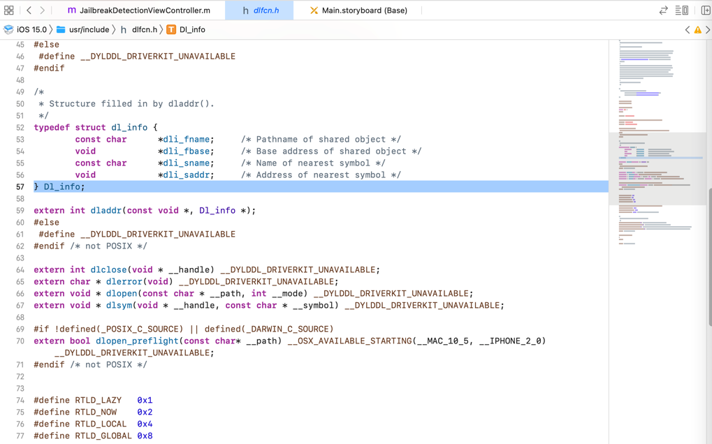
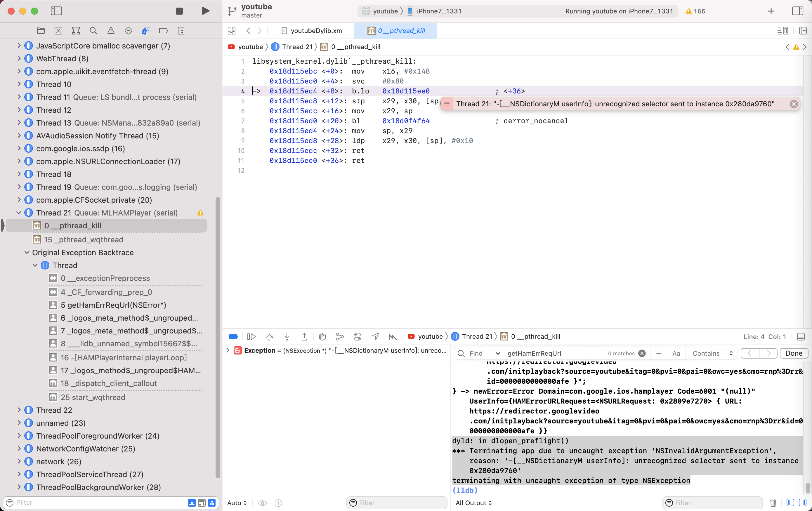

# dlopen_preflight

* 所属头文件: `dlfcn.h`
* 语法定义
  ```c
  bool dlopen_preflight(const char* path);
  ```
  * 详细定义
    * Mac中：`usr/include/dlfcn.h`
      ```c
      #if !defined(_POSIX_C_SOURCE) || defined(_DARWIN_C_SOURCE)
      extern bool dlopen_preflight(const char* __path) __OSX_AVAILABLE_STARTING(__MAC_10_5, __IPHONE_2_0) __DYLDDL_DRIVERKIT_UNAVAILABLE;
      #endif /* not POSIX */
      ```
      * 图
        * 

## man page

```bash
DLOPEN_PREFLIGHT(3)      BSD Library Functions Manual      DLOPEN_PREFLIGHT(3)

NAME
     dlopen_preflight -- preflight the load of a dynamic library or bundle

SYNOPSIS
     #include <dlfcn.h>

     bool
     dlopen_preflight(const char* path);

DESCRIPTION
     dlopen_preflight() examines the mach-o file specified by path.  It checks
     if the file and libraries it depends on are all compatible with the cur-rent current
     rent process.  That is, they contain the correct architecture and are not
     otherwise ABI incompatible.

     dlopen_preflight() was first available in Mac OS X 10.5.

SEARCHING
     dlopen_preflight() uses the same steps as dlopen() to find a compatible
     mach-o file.

RETURN VALUES
     dlopen_preflight() returns true on if the mach-o file is compatible.  If
     the file is not compatible, it returns false and sets an error string
     that can be examined with dlerror().

SEE ALSO
     dlopen(3) dlerror(3)

BSD                             April 17, 2006                             BSD
```

## hook代码

### Frida

```js
Interceptor.attach(Module.findExportByName(null, "dlopen_preflight"), {
    onEnter: function(args) {
        if (args[0].isNull()) return;
        var path = args[0].readUtf8String();
        if (!iswhite(path)) console.log("dlopen_preflight " + path);
    }
})
```

### iOSOpenDev

```c
bool dlopen_preflight(const char* path);

%hookf(bool, dlopen_preflight, const char* path){
    bool isPreLoadOk = %orig;
    iosLogInfo("path=%{public}s -> isPreLoadOk=%s", path, boolToStr(isPreLoadOk));
    return isPreLoadOk;
}
```

有log，但都是系统库，没有任何越狱库：

```bash
默认    15:05:11.453380+0800    Aweme    hook_dylib.xm dlopen_preflight: path=/System/Library/Frameworks/CFNetwork.framework/CFNetwork -> isPreLoadOk=True

默认    15:05:19.144160+0800    Aweme    hook_dylib.xm dlopen_preflight: path=/System/Library/Frameworks/AudioToolbox.framework/AudioToolbox -> isPreLoadOk=True
默认    15:05:19.415606+0800    Aweme    hook_dylib.xm dlopen_preflight: path=/System/Library/Extensions/IOHIDFamily.kext/PlugIns/IOHIDLib.plugin/IOHIDLib -> isPreLoadOk=True
```

### C

[Swizzler/C_function_hooks_section3.xm at master · vtky/Swizzler (github.com)](https://github.com/vtky/Swizzler/blob/master/hooks/C/C_function_hooks_section3.xm)

```c
/*
 dlopen_preflight

dlopen_preflight() examines the mach-o file specified by path.  It checks
 if the file and libraries it depends on are all compatible with the current
 process.  That is, they contain the correct architecture and are not
 otherwise ABI incompatible.

bool dlopen_preflight(const char* path);
*/
bool (*orig_dlopen_preflight) (const char* path);

bool replaced_dlopen_preflight (const char* path)
{
    DDLogVerbose(@"dlopen_preflight: %s", path);

    if (disableJBDectection())
    {
        return 0;
    }

    bool ret = orig_dlopen_preflight(path);
    return ret;
}

...

void C_function_hooks_section3()
{
...
        // dl
        InstallHook(dlopen_preflight);
...
```

## 涉及到的地方

### YouTube

```bash
dyld: in dlopen_preflight()
*** Terminating app due to uncaught exception 'NSInvalidArgumentException', reason: '-[__NSDictionaryM userInfo]: unrecognized selector sent to instance 0x280da9760'
terminating with uncaught exception of type NSException
```


