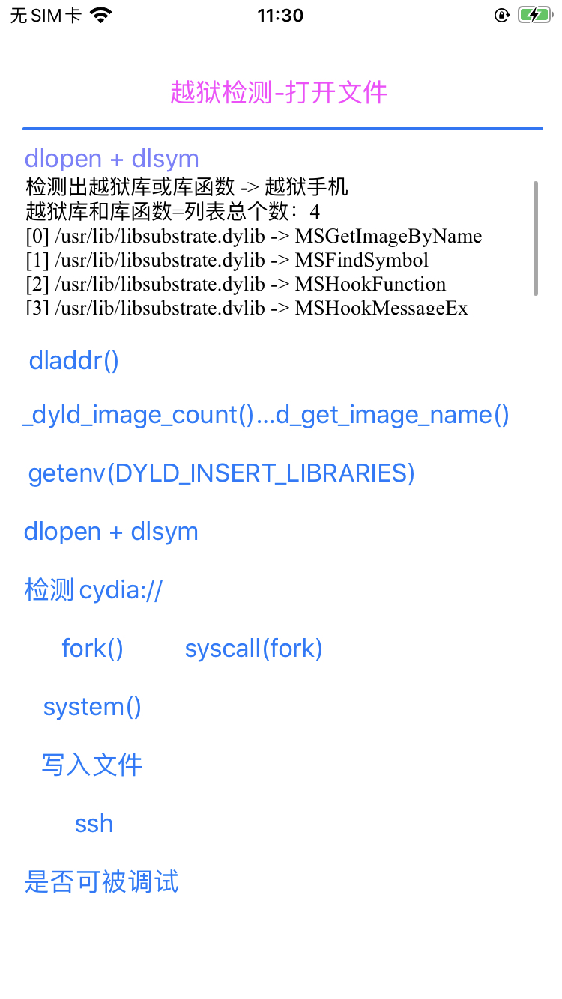
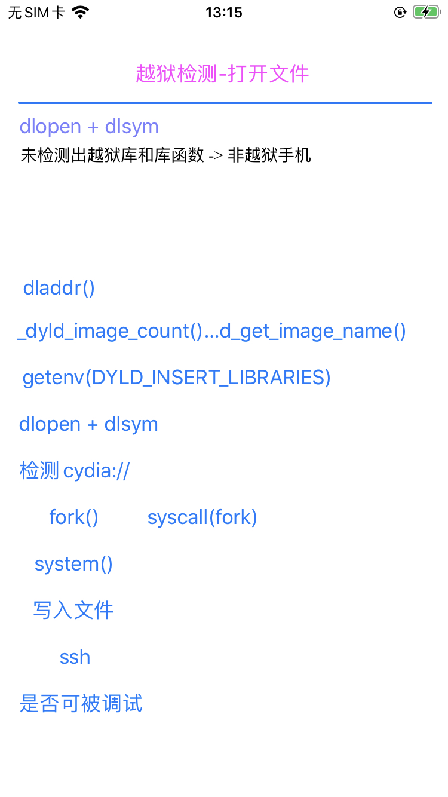

# dlsym

* 所属头文件: `dlfcn.h>`
* 函数定义
  ```c
  void* dlsym(void* handle, const char* symbol);
  ```

## man page

```bash
DLSYM(3)                 BSD Library Functions Manual                 DLSYM(3)

NAME
     dlsym -- get address of a symbol

SYNOPSIS
     #include <dlfcn.h>

     void*
     dlsym(void* handle, const char* symbol);

DESCRIPTION
     dlsym() returns the address of the code or data location specified by the
     null-terminated character string symbol.  Which libraries and bundles are
     searched depends on the handle parameter.

     If dlsym() is called with a handle, returned by dlopen() then only that
     image and any libraries it depends on are searched for symbol.

     If dlsym() is called with the special handle RTLD_DEFAULT, then all mach-o macho
     o images in the process (except those loaded with dlopen(xxx,
     RTLD_LOCAL)) are searched in the order they were loaded.  This can be a
     costly search and should be avoided.

     If dlsym() is called with the special handle RTLD_NEXT, then the search
     for the symbol is limited to the images which were loaded after the one
     issuing the call to dlsym().

RETURN VALUES
     The dlsym() function returns a null pointer if the symbol cannot be
     found, and sets an error condition which may be queried with dlerror().

NOTES
     Unlike other dyld API's, the symbol name passed to dlsym() must NOT be
     prepended with an underscore.

SEE ALSO
     dlopen(3) dlsym(3) dlerror(3) dyld(3) NSModule(3) NSObjectFileImage(3)
     ld(1) cc(1)

                                 Sept 25, 2004
```

## 越狱检测

### 最新代码

* [crifan/iOSJailbreakDetection: iOS的ObjC的app，实现iOS越狱检测](https://github.com/crifan/iOSJailbreakDetection)
  * [JbDetectOtherViewController.m](https://github.com/crifan/iOSJailbreakDetection/blob/main/iOSJailbreakDetection/JbDetectOtherViewController.m)
    * `- (IBAction)dlopenDlsymBtnClicked:(UIButton *)sender`

### 之前代码

```c
    _curBtnLbl.text = sender.titleLabel.text;
    NSLog(@"dlopen + dlsym check");

    typedef void (*function_common) (void *para);
//    typedef void (*lib_MSHookFunction)(void *symbol, void *hook, void **old);

    char* dylibPathList[] = {
//        // for debug
//        "/usr/lib/libstdc++.dylib",
//        "/usr/lib/libstdc++.6.dylib",
//        "/usr/lib/libstdc++.6.0.9.dylib",

        // common: tweak plugin libs
        "/usr/lib/libsubstrate.dylib",

        // Cydia Substrate libs
        "/Library/MobileSubstrate/MobileSubstrate.dylib",
        "/usr/lib/substrate/SubstrateInserter.dylib",
        "/usr/lib/substrate/SubstrateLoader.dylib",
        "/usr/lib/substrate/SubstrateBootstrap.dylib",

        // Substitute libs
        "/usr/lib/libsubstitute.dylib",
        "/usr/lib/substitute-inserter.dylib",
        "/usr/lib/substitute-loader.dylib",

        // Other libs
        "/usr/lib/tweakloader.dylib",
    };
    const int StrSize = sizeof(const char *);
    const int DylibLen = sizeof(dylibPathList) / StrSize;
    
    char* libFuncNameList[] = {
        "MSGetImageByName",
        "MSFindSymbol",
        "MSHookFunction",
        "MSHookMessageEx",
        
        "SubGetImageByName",
        "SubFindSymbol",
        "SubHookFunction",
        "SubHookMessageEx",
    };
    const int LibFuncLen = sizeof(libFuncNameList) / StrSize;

//    NSMutableArray *detectedJbDylibList = [NSMutableArray array];
//    NSMutableArray *detectedJbFuncNameList = [NSMutableArray array];
    NSMutableArray *detectedJbLibAndFuncList = [NSMutableArray array];

    for(int libIdx = 0; libIdx < DylibLen; libIdx++) {
        char* curDylib = dylibPathList[libIdx];
        void *curLibHandle = dlopen(curDylib, RTLD_GLOBAL | RTLD_NOW);
        if (NULL == curLibHandle) {
            char* errStr = dlerror();
            NSLog(@"Failed to open dylib %s, error: %s", curDylib, errStr);
        } else {
//            NSString* curDylibNs = [NSString stringWithFormat:@"%s", curDylib];
//            [detectedJbDylibList addObject:curDylibNs];

            for(int funcIdx = 0; funcIdx < LibFuncLen; funcIdx++) {
                char* curFuncName = libFuncNameList[funcIdx];
                function_common funcInLib = dlsym(curLibHandle, curFuncName);
                if (NULL != funcInLib){
                    NSLog(@"Found func %s=%p in dylib %s\n", curFuncName, funcInLib, curDylib);

//                    NSString* curFuncNameNs = [NSString stringWithFormat:@"%s", curFuncName];
//                    [detectedJbFuncNameList addObject:curFuncNameNs];
                    NSString* curLibAndFuncNs = [NSString stringWithFormat:@"%s -> %s", curDylib, curFuncName];
                    [detectedJbLibAndFuncList addObject:curLibAndFuncNs];
                }
            }

            dlclose(curLibHandle);
        }
    }

    NSString* finalResult =  @"";
//    BOOL isJb = (detectedJbDylibList.count > 0) || (detectedJbFuncNameList.count > 0);
//    NSString *detectedJbDylibListStr = [CrifanLibiOS nsStrListToStr:detectedJbDylibList isSortList:FALSE isAddIndexPrefix:TRUE];
//    NSString *detectedJbFuncNameListStr = [CrifanLibiOS nsStrListToStr:detectedJbFuncNameList isSortList:FALSE isAddIndexPrefix:TRUE];
//    NSString* detectedLibAndFuncNameStr = [NSString stringWithFormat:@"越狱库=%@\n库函数=%@", detectedJbDylibListStr, detectedJbFuncNameListStr] ;
    
    BOOL isJb = (detectedJbLibAndFuncList.count > 0);
    NSString *detectedJbLibAndFuncListStr = [CrifanLibiOS nsStrListToStr:detectedJbLibAndFuncList isSortList:FALSE isAddIndexPrefix:TRUE];
    NSString* detectedLibAndFuncNameStr = [NSString stringWithFormat:@"越狱库和库函数=%@", detectedJbLibAndFuncListStr];

    if (isJb){
        finalResult = [NSString stringWithFormat:@"检测出越狱库或库函数 -> 越狱手机\n%@", detectedLibAndFuncNameStr] ;
    } else {
        finalResult = @"未检测出越狱库和库函数 -> 非越狱手机";
    }
    NSLog(@"finalResult=%@", finalResult);
    _detectResultTv.text = finalResult;
```

## 反越狱检测

### 最新代码

* [crifan/iOSBypassJailbreak: 越狱iOS的hook插件，实现反越狱检测](https://github.com/crifan/iOSBypassJailbreak)
  * [hook_dylib.xm](https://github.com/crifan/iOSBypassJailbreak/blob/main/iOSBypassJailbreak/hook_dylib.xm)

### 之前代码

```c
/*==============================================================================
 Hook: dlsym()
==============================================================================*/
// https://developer.apple.com/library/archive/documentation/System/Conceptual/ManPages_iPhoneOS/man3/dlsym.3.html
void* dlsym(void* handle, const char* symbol);

%hookf(void*, dlsym, void* handle, const char* symbol) {
    iosLogDebug("handle=%p, symbol=%{public}s", handle, symbol);
    void* dlsymRetPtr = NULL;
    bool isJbFuncName = isJailbreakDylibFunctionName(symbol);
    if (isJbFuncName) {
        dlsymRetPtr = NULL;
    } else {
        dlsymRetPtr = %orig(handle, symbol);
    }

    if (isJbFuncName) {
        iosLogInfo("handle=%p, symbol=%{public}s -> isJbFuncName=%s -> dlsymRetPtr=%p", handle, symbol, boolToStr(isJbFuncName), dlsymRetPtr);
    }
    return dlsymRetPtr;
}

/*==============================================================================
 Hook: dlopen()
==============================================================================*/
// https://developer.apple.com/library/archive/documentation/System/Conceptual/ManPages_iPhoneOS/man3/dlopen.3.html
void* dlopen(const char* path, int mode);

%hookf(void*, dlopen, const char* path, int mode){
    iosLogDebug("path=%{public}s, mode=0x%x", path, mode);
    void* dlopenRetPtr = NULL;
    bool isJbDylib = isJailbreakDylib(path);
    if (isJbDylib) {
        dlopenRetPtr = NULL;
    } else {
        dlopenRetPtr = %orig(path, mode);
    }

    if (isJbDylib) {
        iosLogInfo("path=%{public}s, mode=0x%x -> isJbDylib=%s -> dlopenRetPtr=%p", path, mode, boolToStr(isJbDylib), dlopenRetPtr);
    }
    return dlopenRetPtr;
}
```

效果：

反越狱前：



反越狱后：


