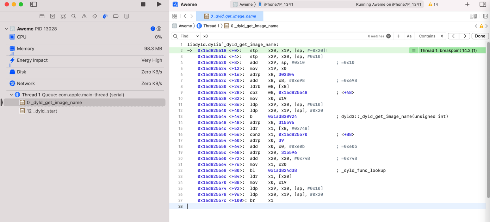
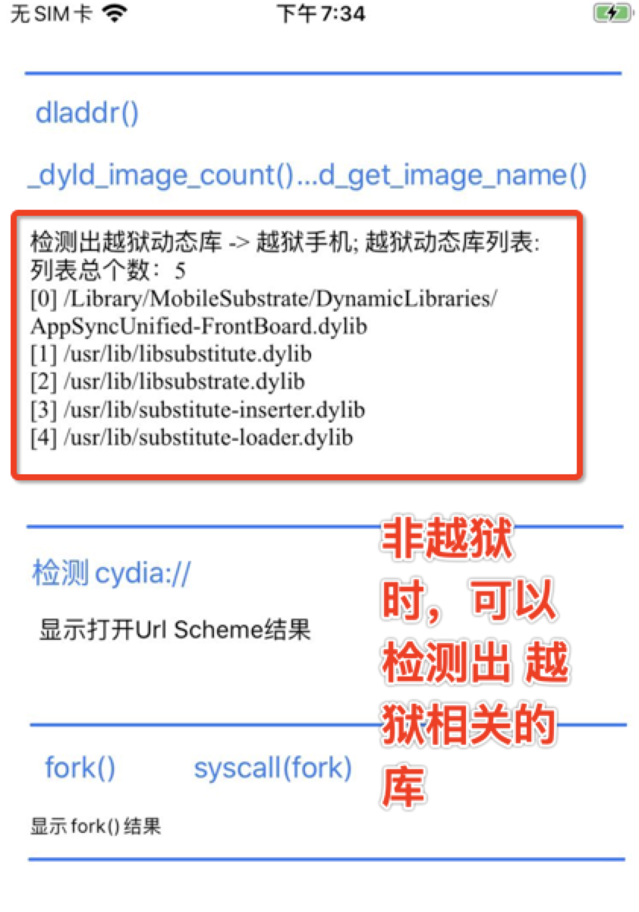
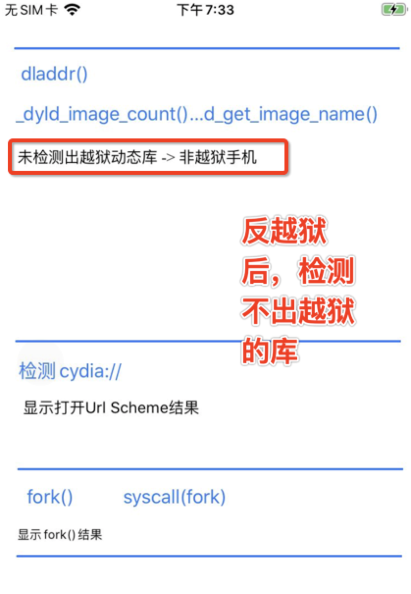

# _dyld_get_image_name

* 语法
  ```c
  const char* _dyld_get_image_name(uint32_t image_index);
  ```

## 反汇编代码



```asm
libdyld.dylib`_dyld_get_image_name:
->  0x1ad825518 <+0>:   stp    x20, x19, [sp, #-0x20]!
    0x1ad82551c <+4>:   stp    x29, x30, [sp, #0x10]
    0x1ad825520 <+8>:   add    x29, sp, #0x10            ; =0x10 
    0x1ad825524 <+12>:  mov    x19, x0
    0x1ad825528 <+16>:  adrp   x8, 303304
    0x1ad82552c <+20>:  add    x8, x8, #0x698            ; =0x698 
    0x1ad825530 <+24>:  ldrb   w8, [x8]
    0x1ad825534 <+28>:  cbz    w8, 0x1ad825548          ; <+48>
    0x1ad825538 <+32>:  mov    x0, x19
    0x1ad82553c <+36>:  ldp    x29, x30, [sp, #0x10]
    0x1ad825540 <+40>:  ldp    x20, x19, [sp], #0x20
    0x1ad825544 <+44>:  b      0x1ad830924              ; dyld3::_dyld_get_image_name(unsigned int)
    0x1ad825548 <+48>:  adrp   x8, 315596
    0x1ad82554c <+52>:  ldr    x1, [x8, #0x748]
    0x1ad825550 <+56>:  cbnz   x1, 0x1ad825570          ; <+88>
    0x1ad825554 <+60>:  adrp   x0, 39
    0x1ad825558 <+64>:  add    x0, x0, #0xe0b            ; =0xe0b 
    0x1ad82555c <+68>:  adrp   x20, 315596
    0x1ad825560 <+72>:  add    x20, x20, #0x748          ; =0x748 
    0x1ad825564 <+76>:  mov    x1, x20
    0x1ad825568 <+80>:  bl     0x1ad824d38              ; _dyld_func_lookup
    0x1ad82556c <+84>:  ldr    x1, [x20]
    0x1ad825570 <+88>:  mov    x0, x19
    0x1ad825574 <+92>:  ldp    x29, x30, [sp, #0x10]
    0x1ad825578 <+96>:  ldp    x20, x19, [sp], #0x20
    0x1ad82557c <+100>: br     x1
```

## 越狱检测

* 上层测试的=正向测试越狱的=iOS的app的

```c
#import <dlfcn.h>
#import <mach-o/dyld.h>

- (void) dbgPrintLibInfo: (int)curImgIdx{
    // debug slide
    intptr_t curSlide = _dyld_get_image_vmaddr_slide(curImgIdx);
    NSLog(@"[%d] curSlide=0x%lx", curImgIdx, curSlide);

    // debug header info
    const struct mach_header* libHeader = _dyld_get_image_header(curImgIdx);
    if (NULL != libHeader){
        int magic = libHeader->magic;
        int cputype = libHeader->cputype;
        int cpusubtype = libHeader->cpusubtype;
        int filetype = libHeader->filetype;
        int ncmds = libHeader->ncmds;
        int sizeofcmds = libHeader->sizeofcmds;
        int flags = libHeader->flags;

        NSLog(@"[%d] magic=%d,cputype=0x%x,cpusubtype=0x%x,filetype=%d,ncmds=%d,sizeofcmds=%d,flags=0x%x",
              curImgIdx,
              magic, cputype, cpusubtype, filetype, ncmds, sizeofcmds, flags);
    } else {
        NSLog(@"[%d] mach_header is NULL", curImgIdx);
    }
}

- (IBAction)dyldImgCntNameBtnClicked:(UIButton *)sender {
    NSLog(@"_dyld_image_count and _dyld_get_image_name check");
    
    //for debug
    int testImgIdx = 282; // hooked:279 ~ real: 284
    [self dbgPrintLibInfo: testImgIdx];

    uint32_t imageCount = _dyld_image_count();
    NSLog(@"dyld: imageCount=%d", imageCount);

    NSMutableArray *loadedDylibList = [NSMutableArray array];

    NSMutableArray *jbDylibList = [NSMutableArray array];
    
    for (uint32_t i = 0 ; i < imageCount; ++i) {
        const char* curImageName = _dyld_get_image_name(i);

        NSString *curImageNameStr = [[NSString alloc]initWithUTF8String: curImageName];
        NSLog(@"[%d] %@", i, curImageNameStr);

        [loadedDylibList addObject:curImageNameStr];

//        if([JbPathList.jbDylibList containsObject:curImageNameStr]){
//        if([JbPathList isJbDylib: curImageNameStr]){

        // for debug
        bool isNeedDebug = (0 == i) || (1 == i) || (2 == i) || (275 == i);

        if(isJailbreakDylib(curImageName)){
            [jbDylibList addObject: curImageNameStr];

            // for debug
            isNeedDebug = true;
        }

        // for debug
        if (isNeedDebug){
            [self dbgPrintLibInfo: i];
        }
    }

//    NSString *loadedDylibListStr = [CrifanLibiOS nsStrListToStr:loadedDylibList];
    NSString *loadedDylibListStr = [CrifanLibiOS nsStrListToStr:loadedDylibList isSortList:TRUE isAddIndexPrefix:TRUE];
    NSLog(@"dyld: loadedDylibListStr=%@", loadedDylibListStr);

    NSString *jbLibListStr = [CrifanLibiOS nsStrListToStr:jbDylibList isSortList:TRUE isAddIndexPrefix:TRUE];
    NSLog(@"dyld: jbDylibList=%@", jbLibListStr);

    NSString* dyldLibResultStr = @"";
    if (jbDylibList.count > 0){
        dyldLibResultStr = [NSString stringWithFormat: @"检测出越狱动态库 -> 越狱手机; 越狱动态库列表:\n%@", jbLibListStr];
    } else{
        dyldLibResultStr = @"未检测出越狱动态库 -> 非越狱手机";
    }
    NSLog(@"dyld: dyldLibResultStr=%@", dyldLibResultStr);

    _dyldResultTv.text = dyldLibResultStr;
}
```

最新代码详见：

* [crifan/iOSJailbreakDetection: iOS的ObjC的app，实现iOS越狱检测](https://github.com/crifan/iOSJailbreakDetection)
  * [JbDetectOtherViewController.m](https://github.com/crifan/iOSJailbreakDetection/blob/main/iOSJailbreakDetection/JbDetectOtherViewController.m)
    * `- (IBAction)dyldImgCntNameBtnClicked:(UIButton *)sender`

## 反越狱检测

* 最新代码和效果
  * 代码
    * [crifan/iOSBypassJailbreak: 越狱iOS的hook插件，实现反越狱检测](https://github.com/crifan/iOSBypassJailbreak)
      * [hook_dyld.xm](https://github.com/crifan/iOSBypassJailbreak/blob/main/iOSBypassJailbreak/hook_dyld.xm)
  * 效果
    * [crifan/iOSBypassJailbreak: 越狱iOS的hook插件，实现反越狱检测](https://github.com/crifan/iOSBypassJailbreak)
      * 未开启反越狱：
        * 能检测出5个越狱的库：
          * 
      * 开启了反越狱：
        * _dyld_image_count
        * _dyld_get_image_name
        * _dyld_get_image_header
        * _dyld_get_image_vmaddr_slide
      * 检测不出任何的越狱的库了：
        * 

## Frida的hook

```js
const dyldGetImgName = Module.findExportByName(null, '_dyld_get_image_name');

Interceptor.attach(dyldGetImgName, {
    onEnter: function (args) {
        // console.log('_dyld_get_image_name: arg1=' + args[1]);
        const arg0 = args[0];
        const arg1 = args[1];
        const arg0Str = Memory.readUtf8String(arg0);
        // const arg0Str = arg0.readPointer().readCString()
        // console.log('_dyld_get_image_name: arg1=%i, arg1Str=%s', arg1, arg1Str);
        console.log('_dyld_get_image_name: arg0=', arg0, 'arg0Str=', arg0Str, 'arg1=', arg1);
    }
});
```
