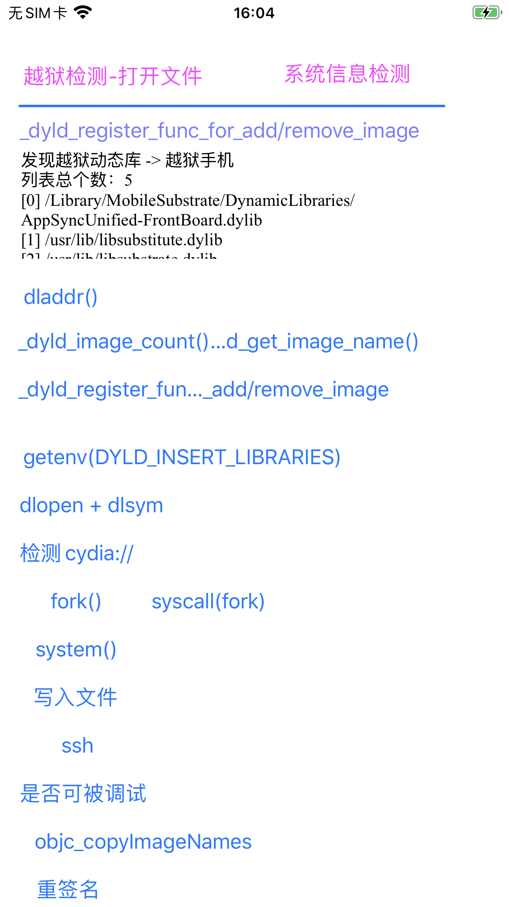
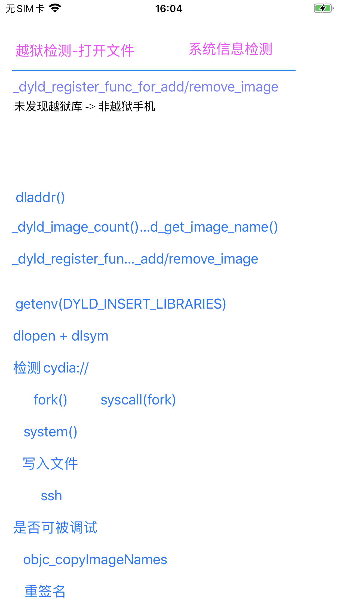

# _dyld_register_func_for_add_image

* 语法
  ```c
  void _dyld_register_func_for_add_image(void (*func)(const struct mach_header* mh, intptr_t vmaddr_slide));
  ```

## 越狱检测

相关代码：

```c
static NSString* checkImageResult = @"未发现越狱库 -> 非越狱手机";
NSMutableArray *checkImageFoundJbLibList = NULL;

//static NSSet *sDylibSet ; // 需要检测的动态库
//static BOOL SCHECK_USER = NO; /// 检测是否越狱

+ (void)load {
  static dispatch_once_t onceToken;
  dispatch_once(&onceToken, ^{
//    sDylibSet  = [NSSet setWithObjects:
//                       @"/usr/lib/CepheiUI.framework/CepheiUI",
//                       @"/usr/lib/libsubstitute.dylib",
//                       @"/usr/lib/substitute-inserter.dylib",
//                       @"/usr/lib/substitute-loader.dylib",
//                       @"/usr/lib/substrate/SubstrateLoader.dylib",
//                       @"/usr/lib/substrate/SubstrateInserter.dylib",
//                       @"/Library/MobileSubstrate/MobileSubstrate.dylib",
//                       @"/Library/MobileSubstrate/DynamicLibraries/0Shadow.dylib",
//
//                  nil];
      checkImageFoundJbLibList = [NSMutableArray array];
      _dyld_register_func_for_add_image(_check_image);
  });
}

+ (instancetype)sharedInstance {
    static id sharedInstance = nil;
    static dispatch_once_t onceToken;
    dispatch_once(&onceToken, ^{
        sharedInstance = [self new];
    });
    return sharedInstance;
}

// 监听image加载，从这里判断动态库是否加载，因为其他的检测动态库的方案会被hook
static void _check_image(const struct mach_header *header, intptr_t slide) {
//    // hook Image load
//    if (SCHECK_USER) {
//        // 检测后就不在检测
//        return;
//    }

    // 检测的lib
    Dl_info info;
    size_t dlInfoSize = sizeof(Dl_info);
    memset(&info, 0, dlInfoSize);

    // 0表示加载失败了，这里大概率是被hook导致的
    int dladdrRet = dladdr(header, &info);
//    if (dladdrRet == 0) {
//        char *dlerro = dlerror();
        // 获取失败了 但是返回了dli_fname, 说明被人hook了，目前看的方案都是直接返回0来绕过的
        const char* curImgName = info.dli_fname;
//        if(dlerro == NULL && curImgName != NULL) {
        if(curImgName != NULL) {
            NSString *curImgNameNs = [NSString stringWithUTF8String: curImgName];
            // 判断有没有在动态列表里面
//            if ([sDylibSet containsObject:curImgNameNs]) {
            if (isJailbreakDylib(curImgName)) {
//                SCHECK_USER = YES;
                [checkImageFoundJbLibList addObject: curImgNameNs];
                NSString *jbLibListStr = [CrifanLibiOS nsStrListToStr:checkImageFoundJbLibList isSortList:TRUE isAddIndexPrefix:TRUE];
                checkImageResult = [NSString stringWithFormat: @"发现越狱动态库 -> 越狱手机\n%@", jbLibListStr];
                NSLog(@"%@", checkImageResult);
                // "Found Jailbreak dylib: /usr/lib/substitute-inserter.dylib -> 越狱手机"
            }
        }
        return;
//    }
}
...
    resultStr = checkImageResult;
```

详见：

[JailbreakPathList.c](https://github.com/crifan/crifanLib/blob/master/c/JailbreakPathList.c)

输出：

```bash
2022-01-21 15:57:49.550319+0800 ShowSysInfo[16209:1127247] 发现越狱动态库 -> 越狱手机
列表总个数：5
[0] /Library/MobileSubstrate/DynamicLibraries/AppSyncUnified-FrontBoard.dylib
[1] /usr/lib/libsubstitute.dylib
[2] /usr/lib/libsubstrate.dylib
[3] /usr/lib/substitute-inserter.dylib
[4] /usr/lib/substitute-loader.dylib
```

是可以检测出越狱库的：



然后开启反越狱后，就检测不到了：

```bash
2022-01-21 15:59:59.578918+0800 ShowSysInfo[16243:1128562] resultStr=未发现越狱库 -> 非越狱手机
```



最新代码详见：

* [crifan/iOSJailbreakDetection: iOS的ObjC的app，实现iOS越狱检测](https://github.com/crifan/iOSJailbreakDetection)
  * [JbDetectOtherViewController.m](https://github.com/crifan/iOSJailbreakDetection/blob/main/iOSJailbreakDetection/JbDetectOtherViewController.m)
    * `+ (void)load`
    * `_check_image`

## 反越狱检测

代码和效果详见：

* [crifan/iOSBypassJailbreak: 越狱iOS的hook插件，实现反越狱检测](https://github.com/crifan/iOSBypassJailbreak)
  * [hook_dyld.xm](https://github.com/crifan/iOSBypassJailbreak/blob/main/iOSBypassJailbreak/hook_dyld.xm)

## 涉及到的地方

### AwemeCore

```bash
  * frame #0: 0x00000001187141e0 XxxTweak.dylib`_logos_function$_ungrouped$getsectiondata(mhp=0x0000000102830000, segname="__DATA", sectname="TimorLoad", size=0x000000016d9ffd58) at hook_machO.xm:192:17 [opt]
    frame #1: 0x0000000114006324 AwemeCore`___lldb_unnamed_symbol1843642$$AwemeCore + 76
    frame #2: 0x0000000114005c60 AwemeCore`___lldb_unnamed_symbol1843637$$AwemeCore + 76
    frame #3: 0x00000001027581ac dyld`dyld::registerAddCallback(void (*)(mach_header const*, long)) + 260
    frame #4: 0x000000018d123f64 libdyld.dylib`_dyld_register_func_for_add_image + 112
...
```
