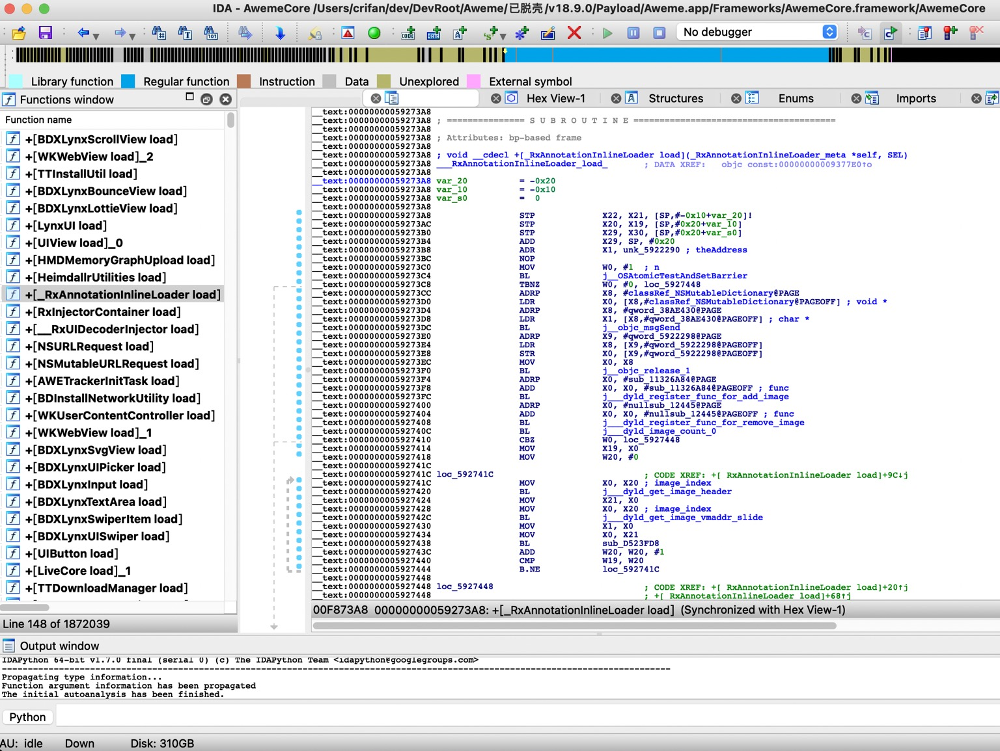

# _dyld_register_func_for_remove_image

* 语法
  ```c
  void _dyld_register_func_for_remove_image(void (*func)(const struct mach_header* mh, intptr_t vmaddr_slide));
  ```

## 反越狱检测

代码和效果详见：

* [crifan/iOSBypassJailbreak: 越狱iOS的hook插件，实现反越狱检测](https://github.com/crifan/iOSBypassJailbreak)
  * [hook_dyld.xm](https://github.com/crifan/iOSBypassJailbreak/blob/main/iOSBypassJailbreak/hook_dyld.xm)

## 涉及到的地方

### Aweme


