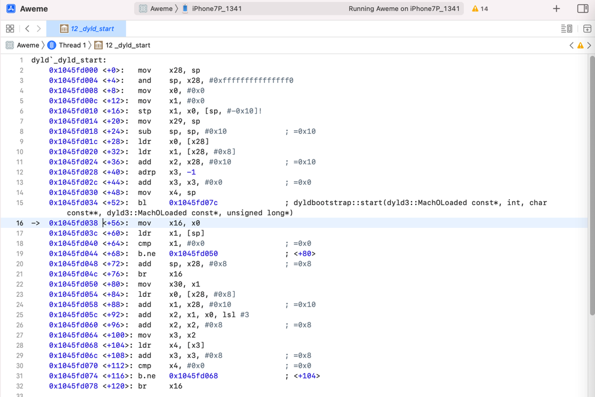
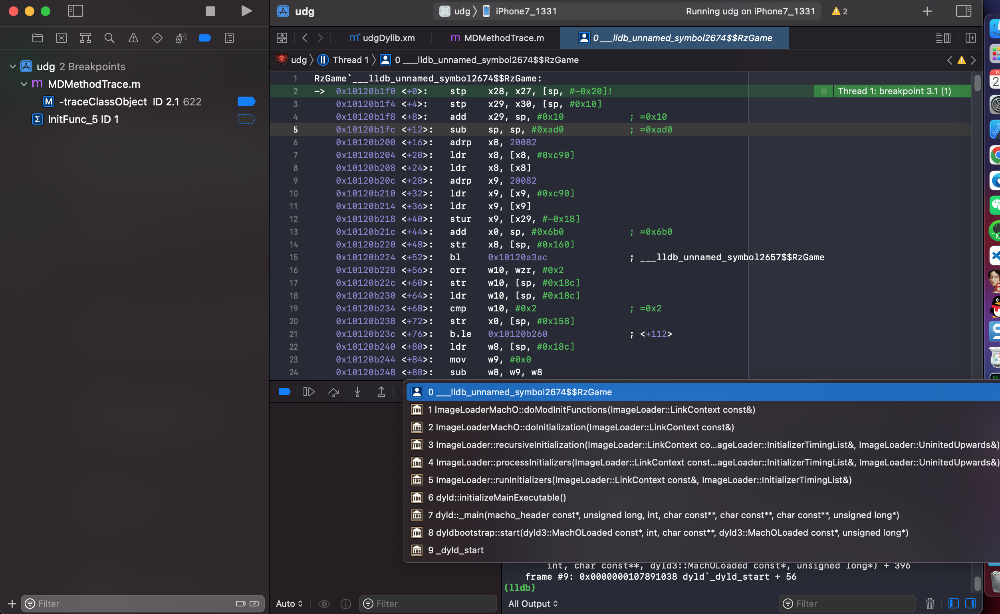
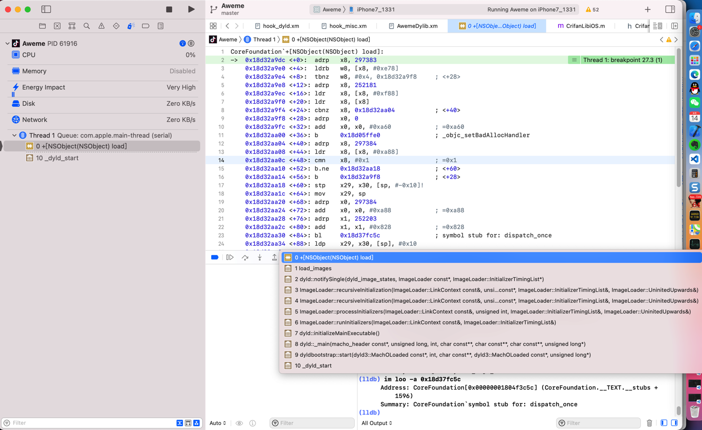

# _dyld_start

* ```dyld`_dyld_start``` == `_dyld_start`

## 反汇编代码



```asm
dyld`_dyld_start:
    0x1045fd000 <+0>:   mov    x28, sp
    0x1045fd004 <+4>:   and    sp, x28, #0xfffffffffffffff0
    0x1045fd008 <+8>:   mov    x0, #0x0
    0x1045fd00c <+12>:  mov    x1, #0x0
    0x1045fd010 <+16>:  stp    x1, x0, [sp, #-0x10]!
    0x1045fd014 <+20>:  mov    x29, sp
    0x1045fd018 <+24>:  sub    sp, sp, #0x10             ; =0x10 
    0x1045fd01c <+28>:  ldr    x0, [x28]
    0x1045fd020 <+32>:  ldr    x1, [x28, #0x8]
    0x1045fd024 <+36>:  add    x2, x28, #0x10            ; =0x10 
    0x1045fd028 <+40>:  adrp   x3, -1
    0x1045fd02c <+44>:  add    x3, x3, #0x0              ; =0x0 
    0x1045fd030 <+48>:  mov    x4, sp
    0x1045fd034 <+52>:  bl     0x1045fd07c              ; dyldbootstrap::start(dyld3::MachOLoaded const*, int, char const**, dyld3::MachOLoaded const*, unsigned long*)
->  0x1045fd038 <+56>:  mov    x16, x0
    0x1045fd03c <+60>:  ldr    x1, [sp]
    0x1045fd040 <+64>:  cmp    x1, #0x0                  ; =0x0 
    0x1045fd044 <+68>:  b.ne   0x1045fd050              ; <+80>
    0x1045fd048 <+72>:  add    sp, x28, #0x8             ; =0x8 
    0x1045fd04c <+76>:  br     x16
    0x1045fd050 <+80>:  mov    x30, x1
    0x1045fd054 <+84>:  ldr    x0, [x28, #0x8]
    0x1045fd058 <+88>:  add    x1, x28, #0x10            ; =0x10 
    0x1045fd05c <+92>:  add    x2, x1, x0, lsl #3
    0x1045fd060 <+96>:  add    x2, x2, #0x8              ; =0x8 
    0x1045fd064 <+100>: mov    x3, x2
    0x1045fd068 <+104>: ldr    x4, [x3]
    0x1045fd06c <+108>: add    x3, x3, #0x8              ; =0x8 
    0x1045fd070 <+112>: cmp    x4, #0x0                  ; =0x0 
    0x1045fd074 <+116>: b.ne   0x1045fd068              ; <+104>
    0x1045fd078 <+120>: br     x16
```

Mac中：

```bash
➜  ~ lldb
(lldb) process connect connect://192.168.0.58:20221
Process 10211 stopped
* thread #1, stop reason = signal SIGSTOP
    frame #0: 0x0000000104b79000 dyld`_dyld_start
dyld`_dyld_start:
->  0x104b79000 <+0>:  mov    x28, sp
    0x104b79004 <+4>:  and    sp, x28, #0xfffffffffffffff0
    0x104b79008 <+8>:  mov    x0, #0x0
    0x104b7900c <+12>: mov    x1, #0x0
Target 0: (Aweme) stopped.
(lldb)
```

某次调试：

```asm
dyld`_dyld_start:
    0x1001b1000 <+0>:   mov    x28, sp
    0x1001b1004 <+4>:   and    sp, x28, #0xfffffffffffffff0
    0x1001b1008 <+8>:   mov    x0, #0x0
    0x1001b100c <+12>:  mov    x1, #0x0
    0x1001b1010 <+16>:  stp    x1, x0, [sp, #-0x10]!
    0x1001b1014 <+20>:  mov    x29, sp
    0x1001b1018 <+24>:  sub    sp, sp, #0x10             ; =0x10 
    0x1001b101c <+28>:  ldr    x0, [x28]
    0x1001b1020 <+32>:  ldr    x1, [x28, #0x8]
    0x1001b1024 <+36>:  add    x2, x28, #0x10            ; =0x10 
    0x1001b1028 <+40>:  adrp   x3, -1
    0x1001b102c <+44>:  add    x3, x3, #0x0              ; =0x0 
    0x1001b1030 <+48>:  mov    x4, sp
    0x1001b1034 <+52>:  bl     0x1001b107c              ; dyldbootstrap::start(dyld3::MachOLoaded const*, int, char const**, dyld3::MachOLoaded const*, unsigned long*)
->  0x1001b1038 <+56>:  mov    x16, x0
```

## 涉及到的地方

### load方法

```bash
0  +[XXObject load]
1  call_class_loads()
2  call_load_methods
3  load_images
4  dyld::notifySingle(dyld_image_states, ImageLoader const*)
11 _dyld_start
```

### RzGame



```bash
(lldb) bt
* thread #1, queue = 'com.apple.main-thread', stop reason = breakpoint 3.1
  * frame #0: 0x000000010120b1f0 RzGame`___lldb_unnamed_symbol2674$$RzGame
    frame #1: 0x00000001078a61b8 dyld`ImageLoaderMachO::doModInitFunctions(ImageLoader::LinkContext const&) + 428
    frame #2: 0x00000001078a658c dyld`ImageLoaderMachO::doInitialization(ImageLoader::LinkContext const&) + 52
    frame #3: 0x00000001078a15d0 dyld`ImageLoader::recursiveInitialization(ImageLoader::LinkContext const&, unsigned int, char const*, ImageLoader::InitializerTimingList&, ImageLoader::UninitedUpwards&) + 548
    frame #4: 0x00000001078a0334 dyld`ImageLoader::processInitializers(ImageLoader::LinkContext const&, unsigned int, ImageLoader::InitializerTimingList&, ImageLoader::UninitedUpwards&) + 184
    frame #5: 0x00000001078a03fc dyld`ImageLoader::runInitializers(ImageLoader::LinkContext const&, ImageLoader::InitializerTimingList&) + 92
    frame #6: 0x0000000107892420 dyld`dyld::initializeMainExecutable() + 216
    frame #7: 0x0000000107896db4 dyld`dyld::_main(macho_header const*, unsigned long, int, char const**, char const**, char const**, unsigned long*) + 4616
    frame #8: 0x0000000107891208 dyld`dyldbootstrap::start(dyld3::MachOLoaded const*, int, char const**, dyld3::MachOLoaded const*, unsigned long*) + 396
    frame #9: 0x0000000107891038 dyld`_dyld_start + 56
```

### AwemeCore



```bash

(lldb) bt
* thread #1, queue = 'com.apple.main-thread', stop reason = breakpoint 17.1
  * frame #0: 0x0000000118786f7c XxxTweak.dylib`_logos_meta_method$_ungrouped$TTMacroManager$isDebug(self=<unavailable>, _cmd=<unavailable>) at hook_aweme.xm:414:5 [opt]
    frame #1: 0x000000010956d818 AwemeCore`___lldb_unnamed_symbol142021$$AwemeCore + 28
...
    frame #14: 0x000000010842c054 AwemeCore`+[AWELaunchMainPlaceholder load] + 84
    frame #15: 0x00000001187872c8 MuJiaBaiHuoTweak.dylib`_logos_meta_method$_ungrouped$AWELaunchMainPlaceholder$load(self=AWELaunchMainPlaceholder, _cmd="load") at hook_aweme.xm:457:5 [opt]
    frame #16: 0x000000018767c35c libobjc.A.dylib`load_images + 984
    frame #17: 0x00000001025ba190 dyld`dyld::notifySingle(dyld_image_states, ImageLoader const*, ImageLoader::InitializerTimingList*) + 448
    frame #18: 0x00000001025ca0d8 dyld`ImageLoader::recursiveInitialization(ImageLoader::LinkContext const&, unsigned int, char const*, ImageLoader::InitializerTimingList&, ImageLoader::UninitedUpwards&) + 512
    frame #19: 0x00000001025ca05c dyld`ImageLoader::recursiveInitialization(ImageLoader::LinkContext const&, unsigned int, char const*, ImageLoader::InitializerTimingList&, ImageLoader::UninitedUpwards&) + 388
    frame #20: 0x00000001025c8520 dyld`ImageLoader::processInitializers(ImageLoader::LinkContext const&, unsigned int, ImageLoader::InitializerTimingList&, ImageLoader::UninitedUpwards&) + 184
    frame #21: 0x00000001025c85e8 dyld`ImageLoader::runInitializers(ImageLoader::LinkContext const&, ImageLoader::InitializerTimingList&) + 92
    frame #22: 0x00000001025ba658 dyld`dyld::initializeMainExecutable() + 216
    frame #23: 0x00000001025beeb0 dyld`dyld::_main(macho_header const*, unsigned long, int, char const**, char const**, char const**, unsigned long*) + 4400
    frame #24: 0x00000001025b9208 dyld`dyldbootstrap::start(dyld3::MachOLoaded const*, int, char const**, dyld3::MachOLoaded const*, unsigned long*) + 396
    frame #25: 0x00000001025b9038 dyld`_dyld_start + 56
```
