# start

* ```dyld`start``` == `dyld`的函数`start`
  * 典型流程
    * dyld的start开始 -> _objc_init函数加载（注册了load_images） -> 触发load_images函数 -> 触发+load方法 -> 在最后才调用main函数 -> 最终输出Hello World

## 涉及到的地方

最早的函数调用都是：

* `dyld`的start

### objc_msgSend

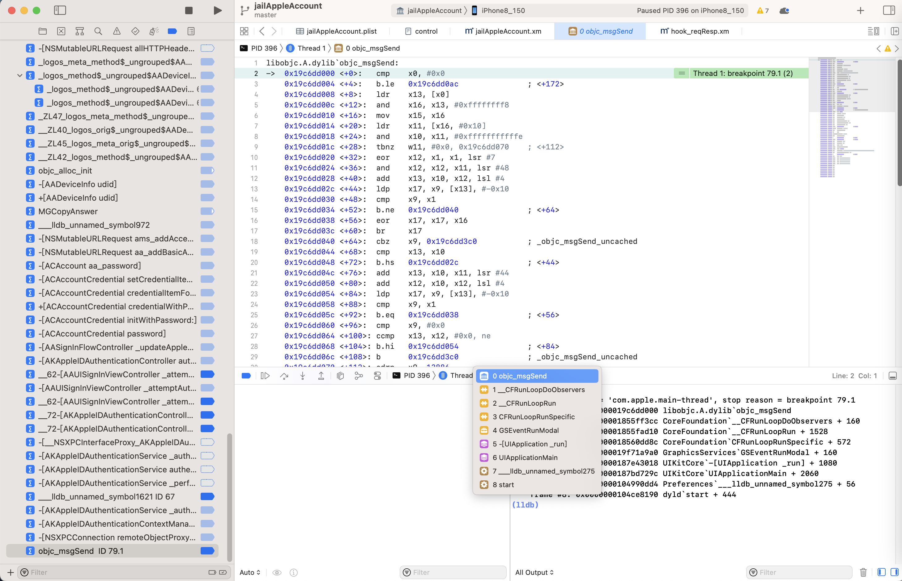

```bash
(lldb) bt
* thread #1, queue = 'com.apple.main-thread', stop reason = breakpoint 79.1
  * frame #0: 0x000000019c6dd000 libobjc.A.dylib`objc_msgSend
    frame #1: 0x00000001855ff3cc CoreFoundation`__CFRunLoopDoObservers + 160
    frame #2: 0x00000001855fad10 CoreFoundation`__CFRunLoopRun + 1528
    frame #3: 0x000000018560dd8c CoreFoundation`CFRunLoopRunSpecific + 572
    frame #4: 0x000000019f71a9a0 GraphicsServices`GSEventRunModal + 160
    frame #5: 0x0000000187e43018 UIKitCore`-[UIApplication _run] + 1080
    frame #6: 0x0000000187bd729c UIKitCore`UIApplicationMain + 2060
    frame #7: 0x0000000104990dd4 Preferences`___lldb_unnamed_symbol275 + 56
    frame #8: 0x0000000104ce8190 dyld`start + 444
```

```bash
(lldb) bt
* thread #1, queue = 'com.apple.main-thread'
  * frame #0: 0x000000019b901094 libobjc.A.dylib`objc_msgSend + 148
    frame #1: 0x00000001870c2ef8 UIKitCore`+[UIFocusRingManager removeRingFromFocusItem:forClient:] + 124
...
    frame #58: 0x0000000187067018 UIKitCore`-[UIApplication _run] + 1080
    frame #59: 0x0000000186dfb29c UIKitCore`UIApplicationMain + 2060
    frame #60: 0x0000000100da0dd4 Preferences`___lldb_unnamed_symbol275 + 56
    frame #61: 0x0000000100f68190 dyld`start + 444
```

### Preferences

```bash
(lldb) bt
* thread #1, queue = 'com.apple.main-thread', stop reason = signal SIGSTOP
  * frame #0: 0x00000001bddf0b70 libsystem_kernel.dylib`mach_msg_trap + 8
    frame #1: 0x00000001bddf1194 libsystem_kernel.dylib`mach_msg + 72
...
    frame #6: 0x0000000187067018 UIKitCore`-[UIApplication _run] + 1080
    frame #7: 0x0000000186dfb29c UIKitCore`UIApplicationMain + 2060
    frame #8: 0x0000000100da0dd4 Preferences`___lldb_unnamed_symbol275 + 56
    frame #9: 0x0000000100f68190 dyld`start + 444
```

### Foundation

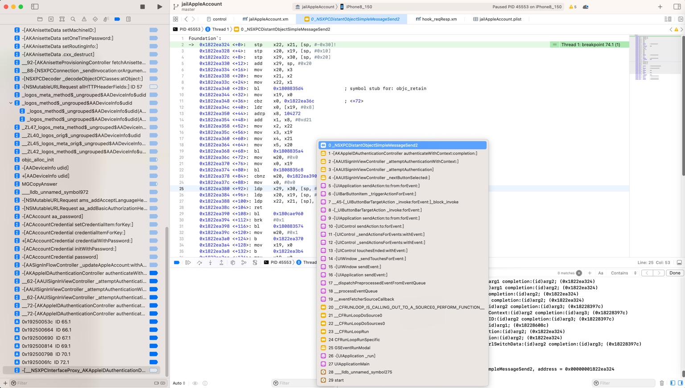

```bash
(lldb) bt
* thread #1, queue = 'com.apple.main-thread', stop reason = breakpoint 74.1
  * frame #0: 0x00000001822ea324 Foundation`_NSXPCDistantObjectSimpleMessageSend2
    frame #1: 0x0000000192500700 AuthKit`-[AKAppleIDAuthenticationController authenticateWithContext:completion:] + 1032
    frame #2: 0x00000001b17504cc AppleAccountUI`-[AAUISignInViewController _attemptAuthenticationWithContext:] + 360
...
    frame #26: 0x000000018336b018 UIKitCore`-[UIApplication _run] + 1080
    frame #27: 0x00000001830ff29c UIKitCore`UIApplicationMain + 2060
    frame #28: 0x0000000104cdcdd4 Preferences`___lldb_unnamed_symbol275 + 56
    frame #29: 0x00000001050c8190 dyld`start + 444
```

### AKAppleIDAuthenticationController

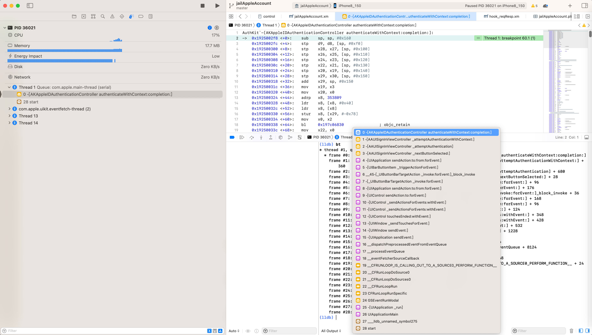

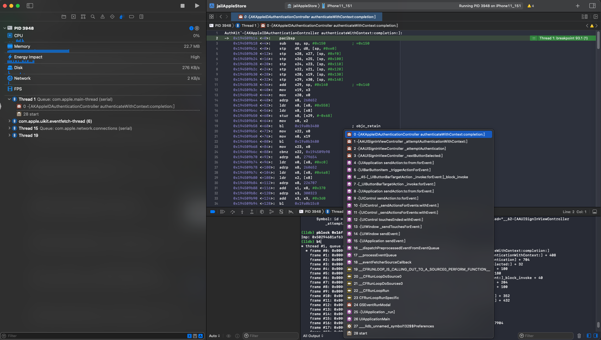

```bash
(lldb) bt
* thread #1, queue = 'com.apple.main-thread', stop reason = breakpoint 93.1
  * frame #0: 0x0000000194509b14 AuthKit`-[AKAppleIDAuthenticationController authenticateWithContext:completion:]
    frame #1: 0x00000001af6315e4 AppleAccountUI`-[AAUISignInViewController _attemptAuthenticationWithContext:] + 408
...
    frame #23: 0x00000001819d73b8 CoreFoundation`CFRunLoopRunSpecific + 600
    frame #24: 0x000000019d36738c GraphicsServices`GSEventRunModal + 164
    frame #25: 0x00000001843776a8 UIKitCore`-[UIApplication _run] + 1100
    frame #26: 0x00000001840f67f4 UIKitCore`UIApplicationMain + 2092
    frame #27: 0x0000000100cd8c0c Preferences`___lldb_unnamed_symbol132$$Preferences + 60
    frame #28: 0x0000000100f89a24 dyld`start + 520
```

### NSXPCConnection

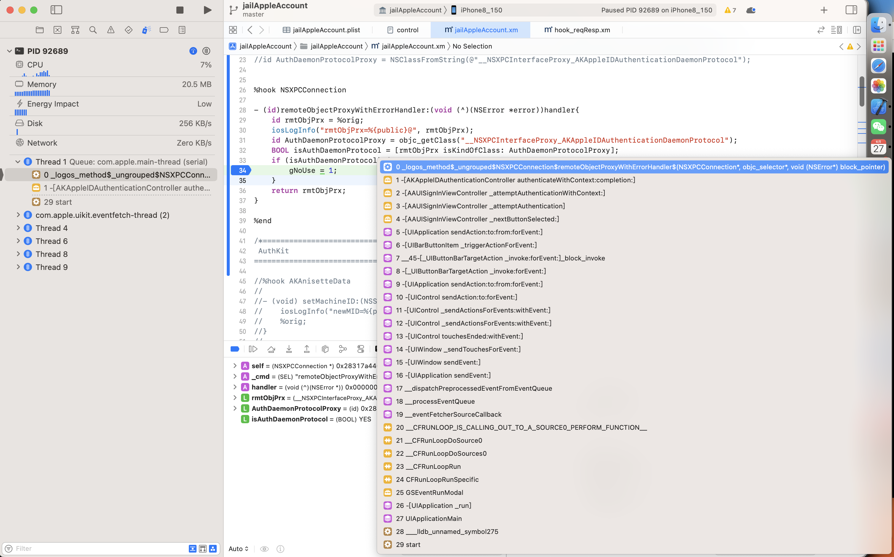

```bash
(lldb) bt
* thread #1, queue = 'com.apple.main-thread', stop reason = breakpoint 69.1
  * frame #0: 0x0000000100b3f5b0 jailAppleAccount.dylib`_logos_method$_ungrouped$NSXPCConnection$remoteObjectProxyWithErrorHandler$(self=0x000000028317a440, _cmd="remoteObjectProxyWithErrorHandler:", handler=0x0000000192500ab4) block_pointer) at jailAppleAccount.xm:34:16
    frame #1: 0x0000000192500618 AuthKit`-[AKAppleIDAuthenticationController authenticateWithContext:completion:] + 800
    frame #2: 0x00000001b17504cc AppleAccountUI`-[AAUISignInViewController _attemptAuthenticationWithContext:] + 360
...
    frame #27: 0x00000001830ff29c UIKitCore`UIApplicationMain + 2060
    frame #28: 0x0000000100900dd4 Preferences`___lldb_unnamed_symbol275 + 56
    frame #29: 0x0000000100b98190 dyld`start + 444
```

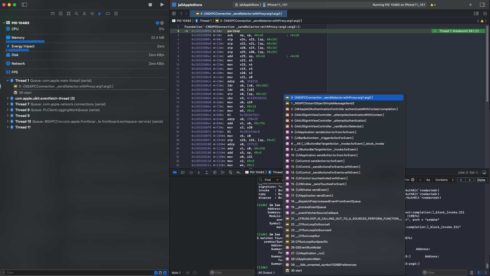

```bash
(lldb) bt
* thread #1, queue = 'com.apple.main-thread', stop reason = breakpoint 59.1
  * frame #0: 0x0000000183258094 Foundation`-[NSXPCConnection _sendSelector:withProxy:arg1:arg2:]
    frame #1: 0x000000018326cce8 Foundation`_NSXPCDistantObjectSimpleMessageSend2 + 76
    frame #2: 0x0000000194509f7c AuthKit`-[AKAppleIDAuthenticationController authenticateWithContext:completion:] + 1128
...
    frame #28: 0x00000001840f67f4 UIKitCore`UIApplicationMain + 2092
    frame #29: 0x0000000104b98c0c Preferences`___lldb_unnamed_symbol132$$Preferences + 60
    frame #30: 0x0000000104cb9a24 dyld`start + 520
```

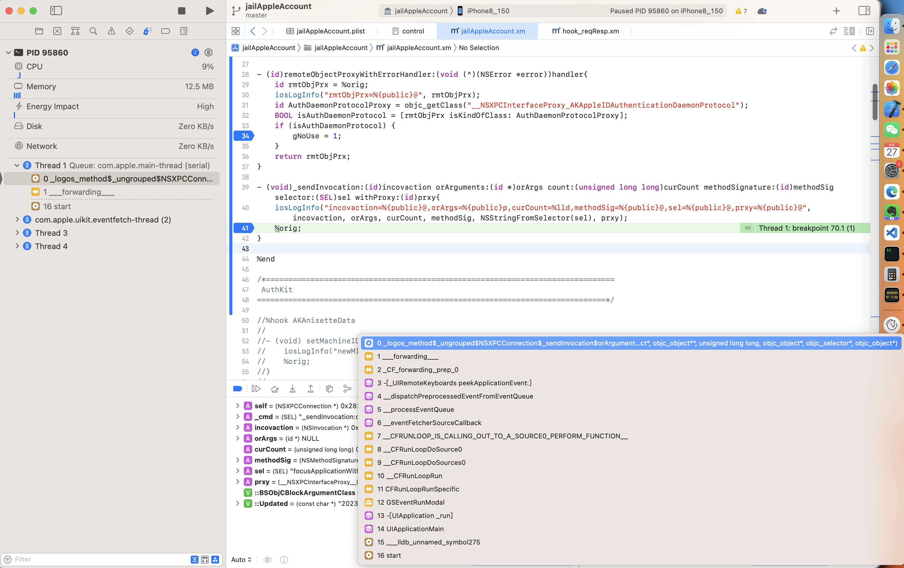

```bash
(lldb) bt
* thread #1, queue = 'com.apple.main-thread', stop reason = breakpoint 70.1
  * frame #0: 0x000000010320b3fc jailAppleAccount.dylib`_logos_method$_ungrouped$NSXPCConnection$_sendInvocation$orArguments$count$methodSignature$selector$withProxy$(self=0x0000000282798f00, _cmd="_sendInvocation:orArguments:count:methodSignature:selector:withProxy:", incovaction=0x000000016d459b60, orArgs=0x0000000000000000, curCount=0, methodSig=0x9cc5d6b183e92d3f, sel="focusApplicationWithProcessIdentifier:sceneIdentity:stealingKeyboard:onCompletion:", prxy=0x0000000283594690) at jailAppleAccount.xm:41:5
    frame #1: 0x0000000180b43bc8 CoreFoundation`___forwarding___ + 652
...
    frame #13: 0x000000018336b018 UIKitCore`-[UIApplication _run] + 1080
    frame #14: 0x00000001830ff29c UIKitCore`UIApplicationMain + 2060
    frame #15: 0x00000001029b0dd4 Preferences`___lldb_unnamed_symbol275 + 56
    frame #16: 0x0000000102bd4190 dyld`start + 444
```

### ACAccountCredential

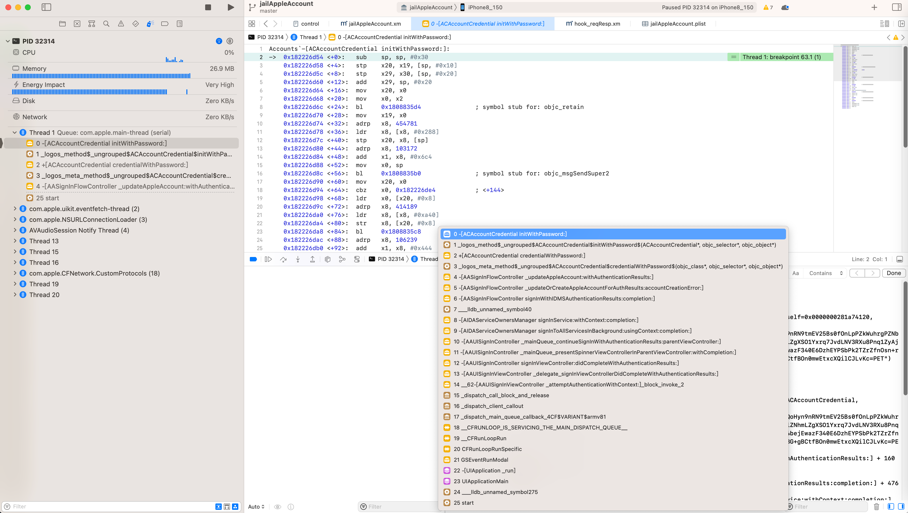

```bash

(lldb) bt
* thread #1, queue = 'com.apple.main-thread', stop reason = breakpoint 63.1
  * frame #0: 0x0000000182226d54 Accounts`-[ACAccountCredential initWithPassword:]
    frame #1: 0x0000000102f4d2b0 jailAppleAccount.dylib`_logos_method$_ungrouped$ACAccountCredential$initWithPassword$(self=0x0000000281a74120, _cmd="initWithPassword:", pwd="GdXoImGkepw1nVVrbSLp/ZbxkHXiDr6h8xBdF9BIc/5yDT+4UUvcAxdmVFKDNkXqM8H+AEgMTvV5QoHyn9nRN9tmEV25Bs0fOnLpPZkWuhrgPZNbMeZ2ZdTsjCMa1mAhUHQQt6Oo6CvPXUqvvv8dKfvs8OPkLgm8TnwtxIUCnLSUtWJCc7yqkRYf2Wc8k9uDllZNhmLZgXSO1Yxrq7JvdLNV3RXu8Pnq1ZyAjUmLX4Yu/lvA8ltT82FY9Rrta6IpBKks8YVBYtuPX6ymP8iAUw8g1NfaraWhrCCwIicOluZaxFXvW16dkb4bejEwazF340E6DzhEYPSbPk2TZrZfnOsn+rcN0cpjd1wfv6R/r1mA5WGmCkdMaJpXDonqzgbCBwLSftxeIJiePbiOD+TFdoifUGVYLo5mmooqCgDp+M+8G+gBCtfBOn0mwEtxcXQilCJLvKc=PET") at jailAppleAccount.xm:91:24
    frame #2: 0x0000000182226f6c Accounts`+[ACAccountCredential credentialWithPassword:] + 56
...
    frame #22: 0x000000018336b018 UIKitCore`-[UIApplication _run] + 1080
    frame #23: 0x00000001830ff29c UIKitCore`UIApplicationMain + 2060
    frame #24: 0x0000000102c10dd4 Preferences`___lldb_unnamed_symbol275 + 56
    frame #25: 0x0000000103000190 dyld`start + 444
```

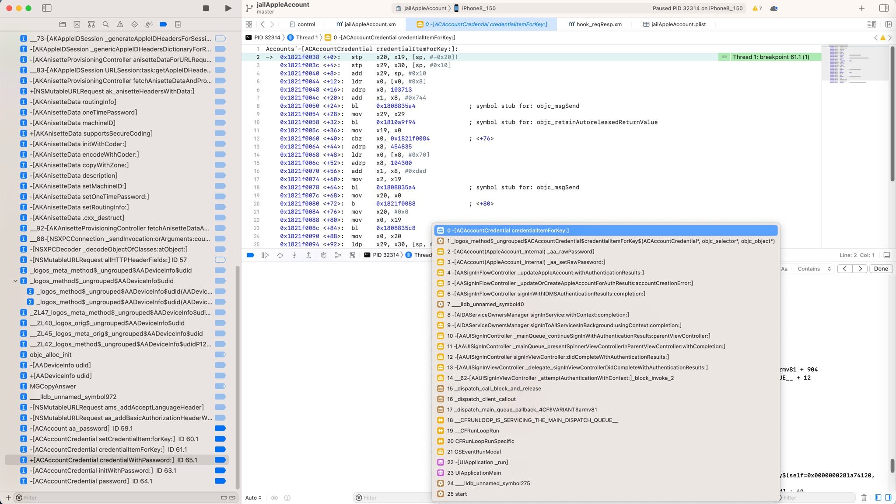

```bash
(lldb) bt
* thread #1, queue = 'com.apple.main-thread', stop reason = breakpoint 61.1
  * frame #0: 0x00000001821f0038 Accounts`-[ACAccountCredential credentialItemForKey:]
    frame #1: 0x0000000102f4d3e0 jailAppleAccount.dylib`_logos_method$_ungrouped$ACAccountCredential$credentialItemForKey$(self=0x0000000281a74120, _cmd="credentialItemForKey:", curKey="rpassword") at jailAppleAccount.xm:109:25
    frame #2: 0x0000000192624da8 AppleAccount`-[ACAccount(AppleAccount_Internal) _aa_rawPassword] + 60
...
    frame #22: 0x000000018336b018 UIKitCore`-[UIApplication _run] + 1080
    frame #23: 0x00000001830ff29c UIKitCore`UIApplicationMain + 2060
    frame #24: 0x0000000102c10dd4 Preferences`___lldb_unnamed_symbol275 + 56
    frame #25: 0x0000000103000190 dyld`start + 444
```

### AAPersonaUtility

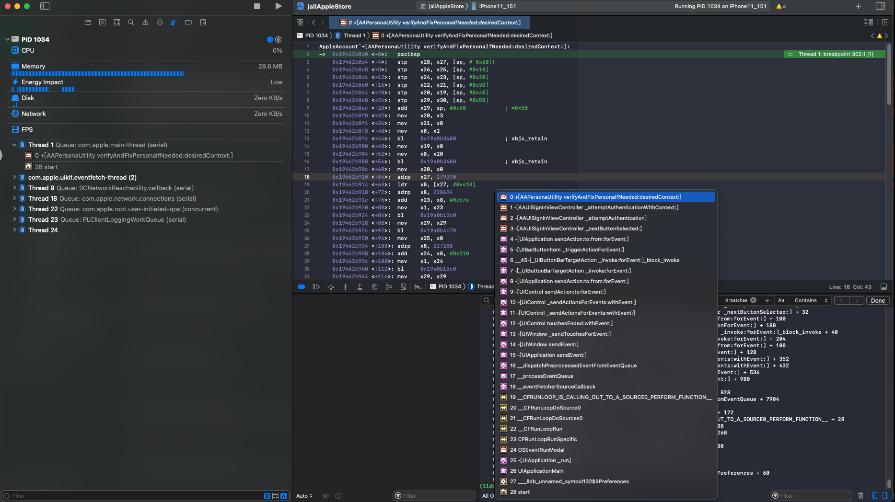

```bash
(lldb) bt
* thread #1, queue = 'com.apple.main-thread', stop reason = breakpoint 302.1
  * frame #0: 0x000000019462b8d0 AppleAccount`+[AAPersonaUtility verifyAndFixPersonaIfNeeded:desiredContext:]
    frame #1: 0x00000001af631534 AppleAccountUI`-[AAUISignInViewController _attemptAuthenticationWithContext:] + 232
...
    frame #26: 0x00000001840f67f4 UIKitCore`UIApplicationMain + 2092
    frame #27: 0x0000000100ba4c0c Preferences`___lldb_unnamed_symbol132$$Preferences + 60
    frame #28: 0x0000000100e99a24 dyld`start + 520
```

### AAUISignInViewController

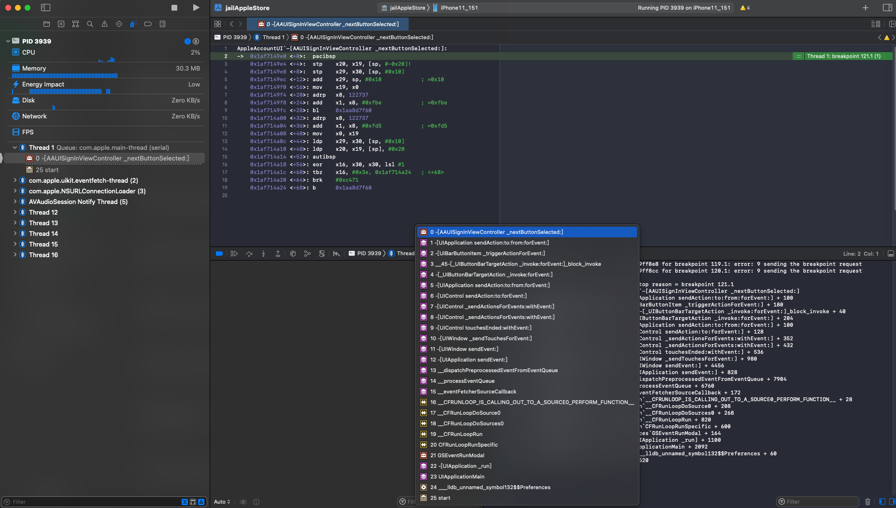

```bash
(lldb) bt
* thread #1, queue = 'com.apple.main-thread', stop reason = breakpoint 121.1
  * frame #0: 0x00000001af7149e0 AppleAccountUI`-[AAUISignInViewController _nextButtonSelected:]
    frame #1: 0x000000018440abf0 UIKitCore`-[UIApplication sendAction:to:from:forEvent:] + 100
...
    frame #23: 0x00000001841da7f4 UIKitCore`UIApplicationMain + 2092
    frame #24: 0x0000000104ed0c0c Preferences`___lldb_unnamed_symbol132$$Preferences + 60
    frame #25: 0x0000000105271a24 dyld`start + 520
```

### akd

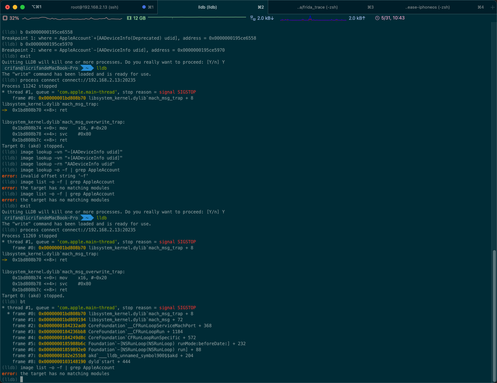

```bash
(lldb) bt
* thread #1, queue = 'com.apple.main-thread', stop reason = signal SIGSTOP
  * frame #0: 0x00000001bd808b70 libsystem_kernel.dylib`mach_msg_trap + 8
    frame #1: 0x00000001bd809194 libsystem_kernel.dylib`mach_msg + 72
    frame #2: 0x0000000184232ad0 CoreFoundation`__CFRunLoopServiceMachPort + 368
    frame #3: 0x0000000184236bb8 CoreFoundation`__CFRunLoopRun + 1184
    frame #4: 0x0000000184249d8c CoreFoundation`CFRunLoopRunSpecific + 572
    frame #5: 0x0000000185988b6c Foundation`-[NSRunLoop(NSRunLoop) runMode:beforeDate:] + 232
    frame #6: 0x00000001859892e0 Foundation`-[NSRunLoop(NSRunLoop) run] + 88
    frame #7: 0x0000000102e255b8 akd`___lldb_unnamed_symbol900$$akd + 204
    frame #8: 0x0000000103148190 dyld`start + 444
```

