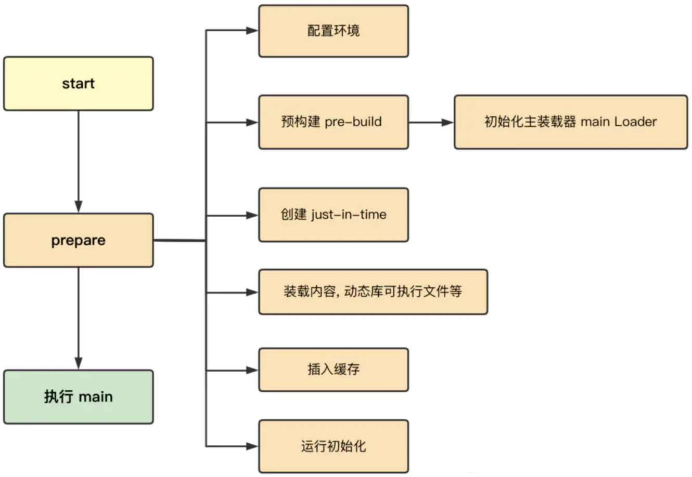
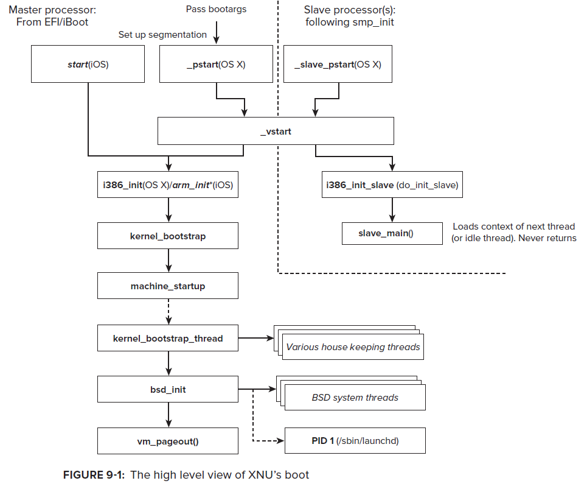

# dyld加载过程

## iOS的app启动过程

* iOS的app启动过程
  * 概述
    * 
  * 详细
    * 
* iOS的app启动的不同阶段
  * `Pre-main`阶段
    * 图
      * 
    * 文字版
      * 加载可执行文件（读取Mach-O）
      * 加载动态库（Dylib）
      * Rebase & Bind
      * Objc
      * Initializers
  * `main`阶段
    * 
* iOS的app启动调用函数
  * 

## dyld加载过程

* dyld加载过程
  * 图
    * 
  * 文字版
    * 图
      * 
  * 文字版：9步
    * 第一步：设置运行环境
    * 第二步：加载共享缓存
    * 第三步：实例化主程序
    * 第四步：加载插入的动态库
    * 第五步：链接主程序
    * 第六步：链接插入的动态库
    * 第七步：执行弱符号绑定
    * 第八步：执行初始化方法
    * 第九步：查找入口点并返回
  * dyld(加载Mach-O)涉及到
    * 校验代码签名codesign
      * segment
      * load commands
    * 映射地址空间address space
      * 即：多个段segment
    * 设置load commands是可执行executable
  * dyld3
    * 
  * dyld4
    * 

### dyld加载过程1

```bash
(lldb) bt
* thread #1, queue = 'com.apple.main-thread', stop reason = breakpoint 23.2
  * frame #0: 0x000000018d124174 libdyld.dylib`dladdr
    frame #1: 0x000000010b0bfbac AwemeCore`___lldb_unnamed_symbol13025$$AwemeCore + 80
    frame #2: 0x000000018d041c38 libobjc.A.dylib`CALLING_SOME_+initialize_METHOD + 20
    frame #3: 0x000000018d04742c libobjc.A.dylib`initializeNonMetaClass + 644
    frame #4: 0x000000018d0471f8 libobjc.A.dylib`initializeNonMetaClass + 80
    frame #5: 0x000000018d047ba8 libobjc.A.dylib`initializeAndMaybeRelock(objc_class*, objc_object*, mutex_tt<false>&, bool) + 284
    frame #6: 0x000000018d05450c libobjc.A.dylib`lookUpImpOrForward + 700
    frame #7: 0x000000018d0448a8 libobjc.A.dylib`object_setClass + 104
    frame #8: 0x000000018d29da70 CoreFoundation`_CFRuntimeCreateInstance + 580
    frame #9: 0x000000018d2bcb74 CoreFoundation`__CFStringCreateImmutableFunnel3 + 1944
    frame #10: 0x000000018d2bcef8 CoreFoundation`CFStringCreateWithCString + 92
    frame #11: 0x000000018d29f610 CoreFoundation`__CFInitialize + 812
    frame #12: 0x0000000104fddfac dyld`ImageLoaderMachO::doImageInit(ImageLoader::LinkContext const&) + 248
    frame #13: 0x0000000104fde580 dyld`ImageLoaderMachO::doInitialization(ImageLoader::LinkContext const&) + 40
    frame #14: 0x0000000104fd95d0 dyld`ImageLoader::recursiveInitialization(ImageLoader::LinkContext const&, unsigned int, char const*, ImageLoader::InitializerTimingList&, ImageLoader::UninitedUpwards&) + 548
    frame #15: 0x0000000104fd953c dyld`ImageLoader::recursiveInitialization(ImageLoader::LinkContext const&, unsigned int, char const*, ImageLoader::InitializerTimingList&, ImageLoader::UninitedUpwards&) + 400
    frame #16: 0x0000000104fd8334 dyld`ImageLoader::processInitializers(ImageLoader::LinkContext const&, unsigned int, ImageLoader::InitializerTimingList&, ImageLoader::UninitedUpwards&) + 184
    frame #17: 0x0000000104fd83fc dyld`ImageLoader::runInitializers(ImageLoader::LinkContext const&, ImageLoader::InitializerTimingList&) + 92
    frame #18: 0x0000000104fca3d0 dyld`dyld::initializeMainExecutable() + 136
    frame #19: 0x0000000104fcedb4 dyld`dyld::_main(macho_header const*, unsigned long, int, char const**, char const**, char const**, unsigned long*) + 4616
    frame #20: 0x0000000104fc9208 dyld`dyldbootstrap::start(dyld3::MachOLoaded const*, int, char const**, dyld3::MachOLoaded const*, unsigned long*) + 396
    frame #21: 0x0000000104fc9038 dyld`_dyld_start + 56
```

==

* dyld`_dyld_start
  * dyld`dyldbootstrap::start
    * dyld`dyld::_main
      * dyld`dyld::initializeMainExecutable
        * dyld`ImageLoader::runInitializers
          * dyld`ImageLoader::processInitializers
            * dyld`ImageLoader::recursiveInitialization
              * dyld`ImageLoaderMachO::doInitialization
                * dyld`ImageLoaderMachO::doImageInit
                  * ...
                    * libdyld.dylib`dladdr

### dyld加载过程2

* _dyld_start
  * dyldbootstrap: : start
    * dyld: : _main
      * dyld: : initializeMainExecutable
        * ImageLoader::runInitializers
          * ImageLoader::processInitializers
            * ImageLoader::recursiveInitialization
              * Dyld ::notifySingle
                * libobjC.a. dylib load_images
                  * +[ViewController load]

### dyld加载过程3

```bash
(lldb) bt
* thread #1, queue = 'com.apple.main-thread', stop reason = breakpoint 6.1
  * frame #0: 0x0000000102495310 libAwemeDylib.dylib`_logos_method$_ungrouped$NSString$stringByAppendingString$(self="https://", _cmd="stringByAppendingString:", aString=0x0000000000000000) at AwemeDylib.xm:175:29
    frame #1: 0x0000000108532cf8 AwemeCore`___lldb_unnamed_symbol3548$$AwemeCore + 520
...
    frame #38: 0x00000001c2ecf60c FrontBoardServices`-[FBSSerialQueue _performNextFromRunLoopSource] + 28
    frame #39: 0x00000001bdcd0a00 CoreFoundation`__CFRUNLOOP_IS_CALLING_OUT_TO_A_SOURCE0_PERFORM_FUNCTION__ + 24
    frame #40: 0x00000001bdcd0958 CoreFoundation`__CFRunLoopDoSource0 + 80
    frame #41: 0x00000001bdcd00f0 CoreFoundation`__CFRunLoopDoSources0 + 180
    frame #42: 0x00000001bdccb23c CoreFoundation`__CFRunLoopRun + 1080
    frame #43: 0x00000001bdccaadc CoreFoundation`CFRunLoopRunSpecific + 464
    frame #44: 0x00000001c7c6b328 GraphicsServices`GSEventRunModal + 104
    frame #45: 0x00000001c1dd863c UIKitCore`UIApplicationMain + 1936
    frame #46: 0x000000010efec094 AwemeCore`awemeMain + 200
    frame #47: 0x0000000102267ca4 Aweme`___lldb_unnamed_symbol21$$Aweme + 12
    frame #48: 0x00000001bdb54360 libdyld.dylib`start + 4
```

* libdyld.dylib`start 开始的调用顺序
  * app相关逻辑：Aweme`___lldb_unnamed_symbol21$$Aweme、AwemeCore`awemeMain
    * 然后才是其他系统常见函数
      * UIKitCore`UIApplicationMain
        * ...

## 相关

### launchd

launchd是第一个被内核启动的用户态进程，负责直接或间接的启动系统中的其他进程。它是用户模式里所有进程的父进程，同时也将负责两种后台作业：守护程序和代理程序。

* 守护程序：后台服务，通常和用户没有交互。比如push通知、外接设备插入的处理和XPC等。
* 代理程序：可以和用户交互，比如Mac的Finder或iOS的SpringBoard就是其中之一，即广义上我们理解的桌面。

launchd是如何被创建的，得先看下下面这张：

* XNU启动流程图
  * 图
    * 
  * 文字
    * `start(iOS)`：初始化MSR、物理页映射、安装中断处理函数
    * `arm_init(iOS)`：初始化平台，为启动内核做准备
    * `machine_startup`：解析命令行参数和调试参数
    * `kernel_bootstrap`：安装和初始化mach内核的子系统，包括：进程间通信、时钟、访问策略、进程和线程调度
    * `kernel_bootstrap_thread`：创建idle线程，初始化iokit设备驱动框架，初始化应用程序和dyld运行所需的共享模块。如果内核开启了mac(强制访问控制)策略，则会进行mac的初始化，以确系统的安全
    * `bsd_init`：内核部分剩余的事情都由其来做，初始化各个子系统。网络、文件系统、管道、内存cache、线程、进程、同步对象、权限策略等等。 一切完成后，会执行/sbin/launchd来创建一个launchd
