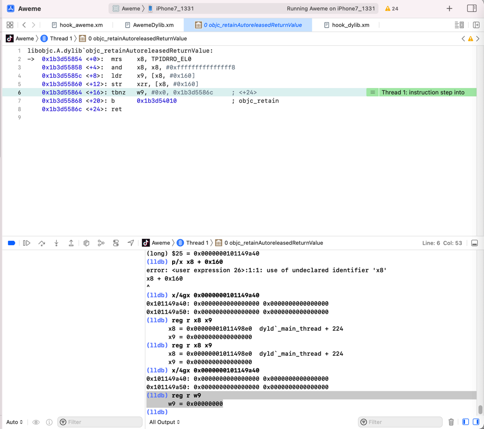
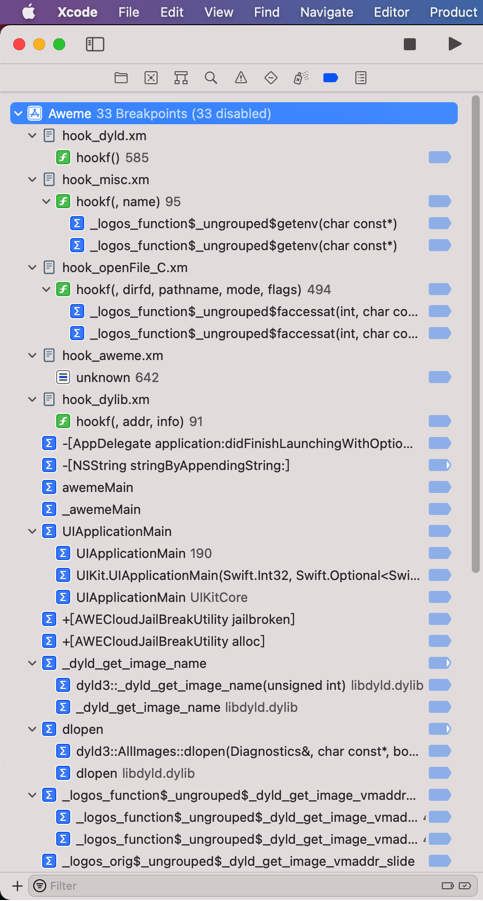
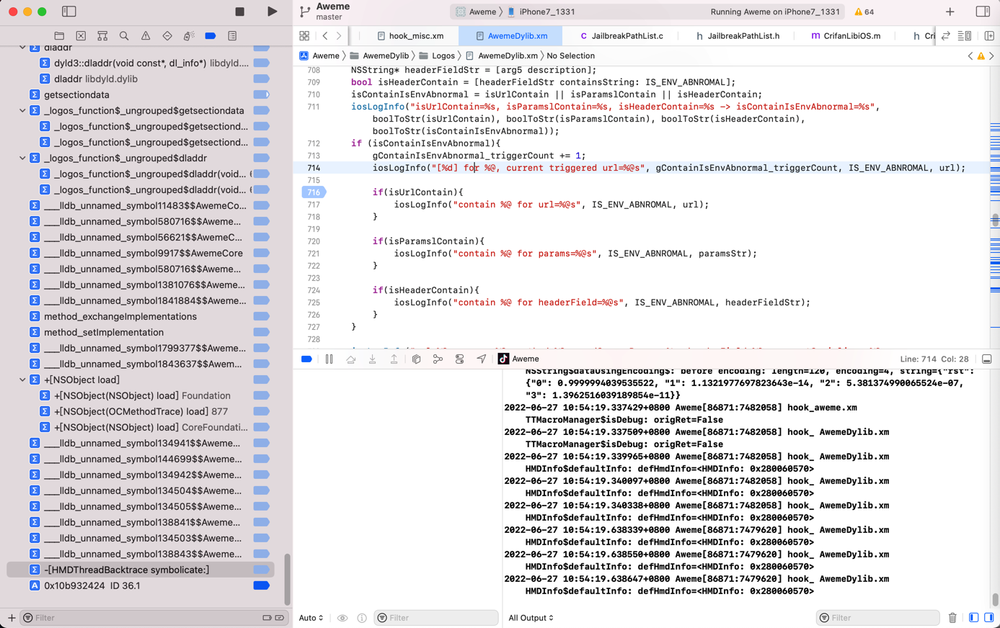
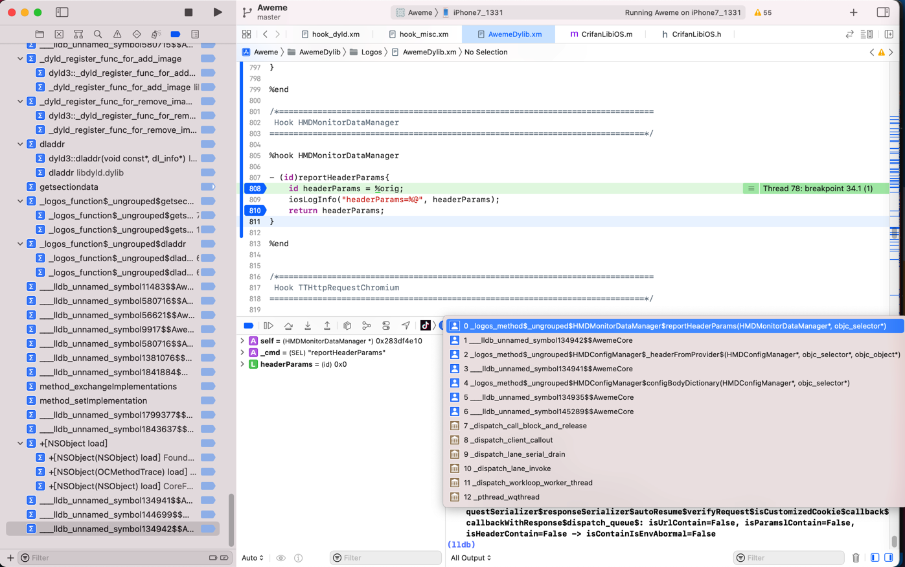
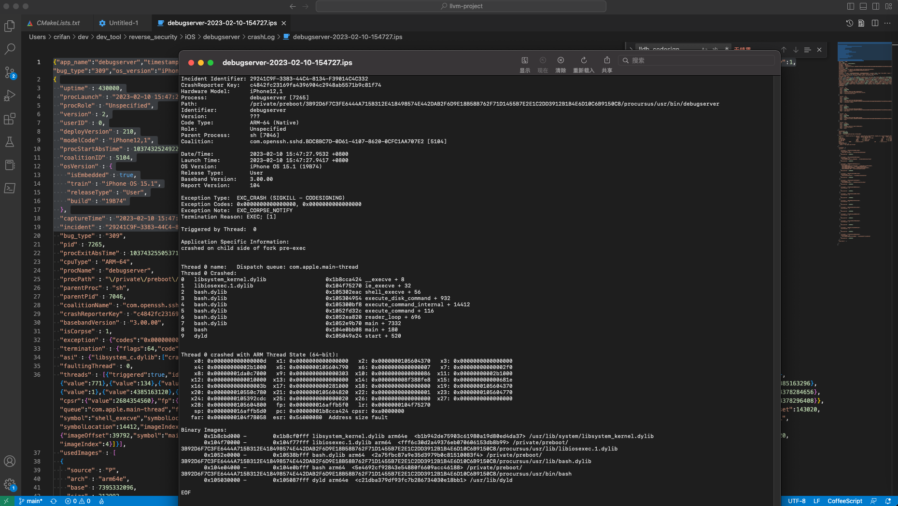
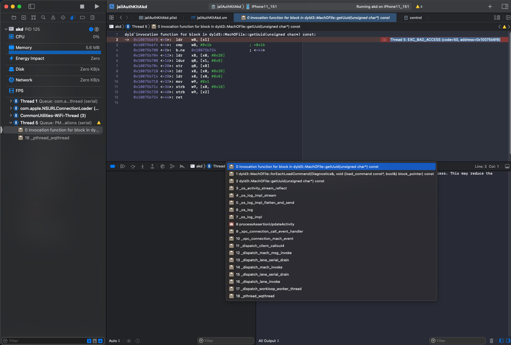
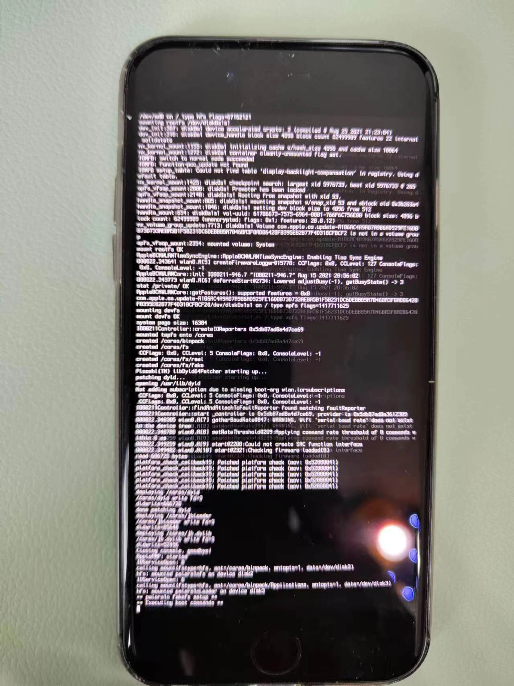
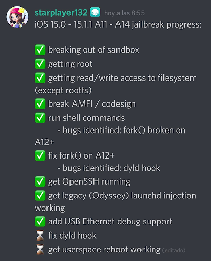

# 涉及的地方

## libdyld.dylib相关


### getsegmentdata

```bash
(lldb) bt
* thread #1, queue = 'com.apple.main-thread', stop reason = breakpoint 24.1
  * frame #0: 0x000000011a57de70 MuJiaBaiHuoTweak.dylib`_logos_function$_ungrouped$getsegmentdata(mhp=0x000000011a570000, segname="__TEXT", size=0x000000016b097c80) at hook_machO.xm:32:27 [opt]
    frame #1: 0x000000019205c2e8 libsystem_trace.dylib`_os_log_impl_flatten_and_send + 1920
    frame #2: 0x000000019205bb50 libsystem_trace.dylib`_os_log + 152
    frame #3: 0x000000019205e184 libsystem_trace.dylib`_os_log_impl + 12
    frame #4: 0x000000011a57e8c4 MuJiaBaiHuoTweak.dylib`_logosLocalCtor_f29c21d4(argc=<unavailable>, argv=<unavailable>, envp=<unavailable>) at hook_aweme.xm:618:9 [opt]
    frame #5: 0x00000001051872c4 dyld`ImageLoaderMachO::doModInitFunctions(ImageLoader::LinkContext const&) + 428
    frame #6: 0x00000001051876b0 dyld`ImageLoaderMachO::doInitialization(ImageLoader::LinkContext const&) + 52
    frame #7: 0x00000001051820f0 dyld`ImageLoader::recursiveInitialization(ImageLoader::LinkContext const&, unsigned int, char const*, ImageLoader::InitializerTimingList&, ImageLoader::UninitedUpwards&) + 536
    frame #8: 0x0000000105180520 dyld`ImageLoader::processInitializers(ImageLoader::LinkContext const&, unsigned int, ImageLoader::InitializerTimingList&, ImageLoader::UninitedUpwards&) + 184
    frame #9: 0x00000001051805e8 dyld`ImageLoader::runInitializers(ImageLoader::LinkContext const&, ImageLoader::InitializerTimingList&) + 92
    frame #10: 0x0000000105175a64 dyld`dyld::runInitializers(ImageLoader*) + 88
    frame #11: 0x000000010517c7b8 dyld`dlopen_internal + 832
    frame #12: 0x00000001922ada08 libdyld.dylib`dlopen + 172
    frame #13: 0x000000011bc4efd0 substitute-loader.dylib
    frame #14: 0x000000011bc4eff0 substitute-loader.dylib
    frame #15: 0x000000011bc4f010 substitute-loader.dylib
    frame #16: 0x000000011bc23168 substitute-loader.dylib
    frame #17: 0x000000011bb6484c substitute-loader.dylib
    frame #18: 0x000000011bb63b28 substitute-loader.dylib
    frame #19: 0x000000011bbae7b8 substitute-loader.dylib
    frame #20: 0x000000011bb680dc substitute-loader.dylib
    frame #21: 0x00000001051872c4 dyld`ImageLoaderMachO::doModInitFunctions(ImageLoader::LinkContext const&) + 428
    frame #22: 0x00000001051876b0 dyld`ImageLoaderMachO::doInitialization(ImageLoader::LinkContext const&) + 52
    frame #23: 0x00000001051820f0 dyld`ImageLoader::recursiveInitialization(ImageLoader::LinkContext const&, unsigned int, char const*, ImageLoader::InitializerTimingList&, ImageLoader::UninitedUpwards&) + 536
    frame #24: 0x0000000105180520 dyld`ImageLoader::processInitializers(ImageLoader::LinkContext const&, unsigned int, ImageLoader::InitializerTimingList&, ImageLoader::UninitedUpwards&) + 184
    frame #25: 0x00000001051805e8 dyld`ImageLoader::runInitializers(ImageLoader::LinkContext const&, ImageLoader::InitializerTimingList&) + 92
    frame #26: 0x0000000105175a64 dyld`dyld::runInitializers(ImageLoader*) + 88
    frame #27: 0x000000010517c7b8 dyld`dlopen_internal + 832
    frame #28: 0x00000001922ada08 libdyld.dylib`dlopen + 172
    frame #29: 0x000000010532d284 substitute-inserter.dylib`___lldb_unnamed_symbol385$$substitute-inserter.dylib + 1288
    frame #30: 0x000000010563aac0 substitute-inserter.dylib`___lldb_unnamed_symbol1524$$substitute-inserter.dylib + 12
    frame #31: 0x00000001055fb980 substitute-inserter.dylib`___lldb_unnamed_symbol1415$$substitute-inserter.dylib + 40580
    frame #32: 0x00000001051872c4 dyld`ImageLoaderMachO::doModInitFunctions(ImageLoader::LinkContext const&) + 428
    frame #33: 0x00000001051876b0 dyld`ImageLoaderMachO::doInitialization(ImageLoader::LinkContext const&) + 52
    frame #34: 0x00000001051820f0 dyld`ImageLoader::recursiveInitialization(ImageLoader::LinkContext const&, unsigned int, char const*, ImageLoader::InitializerTimingList&, ImageLoader::UninitedUpwards&) + 536
    frame #35: 0x0000000105180520 dyld`ImageLoader::processInitializers(ImageLoader::LinkContext const&, unsigned int, ImageLoader::InitializerTimingList&, ImageLoader::UninitedUpwards&) + 184
    frame #36: 0x00000001051805e8 dyld`ImageLoader::runInitializers(ImageLoader::LinkContext const&, ImageLoader::InitializerTimingList&) + 92
    frame #37: 0x0000000105172608 dyld`dyld::initializeMainExecutable() + 136
    frame #38: 0x0000000105176eb0 dyld`dyld::_main(macho_header const*, unsigned long, int, char const**, char const**, char const**, unsigned long*) + 4400
    frame #39: 0x0000000105171208 dyld`dyldbootstrap::start(dyld3::MachOLoaded const*, int, char const**, dyld3::MachOLoaded const*, unsigned long*) + 396
    frame #40: 0x0000000105171038 dyld`_dyld_start + 56
```

### dyldbootstrap::start

```c
dyldbootstrap::start(dyld3::MachOLoaded const*, int, char const**, dyld3::MachOLoaded const*, unsigned long*)
```

### _libdyld_initialize

`fromiPhone/dyld_rabin2_s_symbols.txt`

```bash
330  0x0001596c 0x0001596c LOCAL  FUNC 0        dyld4::APIs::_libdyld_initialize(dyld4::LibSystemHelpers const*)
```

意思是：

* 上面的函数 = C++代码中的函数的原始定义
  * `dyld4::APIs::_libdyld_initialize(dyld4::LibSystemHelpers const*)`
* 经过编译，最终会生成为：
  * `__ZN5dyld44APIs19_libdyld_initializeEPKNS_16LibSystemHelpersE`
    * `__ZN5 dyld 44 APIs 19 _libdyld_initialize EPKNS_16 LibSystemHelpers E`

### 杂项

```bash
(lldb) bt
...
    frame #3: 0x00000001922ac2e4 libdyld.dylib`LockHelper::LockHelper() + 28
    frame #4: 0x00000001922ad780 libdyld.dylib`dladdr + 112
...
```

## dyld相关函数

### dyld`_main_thread




### MaskDylib

```bash
➜  DynamicLibraries rabin2 -i Mask.dylib > MaskDylib_rabin2_i_imports.txt
```

->

MaskDylib_rabin2_i_imports.coffee

```asm
40  0x0000e49c NONE FUNC           _dyld_get_image_header
41  0x0000e4a8 NONE FUNC           _dyld_get_image_name
42  0x0000e4b4 NONE FUNC           _dyld_image_count
...
50  0x0000e508 NONE FUNC           dyld_shared_cache_file_path
```

### 调试Aweme







### statfs

```bash
(lldb) image lookup -s statfs
1 symbols match 'statfs' in /Users/crifan/Library/Developer/Xcode/iOS DeviceSupport/13.3.1 (17D50)/Symbols/usr/lib/dyld:
        Address: dyld[0x000000000004c324] (dyld.__TEXT.__text + 308004)
        Summary: dyld`statfs64
1 symbols match 'statfs' in /Users/crifan/Library/Developer/Xcode/DerivedData/Aweme-fswcidjoxbkibsdwekuzlsfcdqls/Build/Products/Debug-iphoneos/Aweme.app/Frameworks/AwemeCore.framework/AwemeCore:
...
```

## /usr/lib/dyld

* 常见位置：
  * `/cores/dyld`
  * `/usr/lib/dyld`
* 常见逻辑
  * `image list`查看出的，加载的image镜像，看起来的总体逻辑都是：
    * 先加载app自己
      * `RzGame`
      * `Aweme`
    * 然后就是dyld
      * `/cores/dyld`
      * `/Users/crifan/Library/Developer/Xcode/iOS DeviceSupport/13.3.1 (17D50)/Symbols/usr/lib/dyld`

涉及到的地方：

### iPhone8

```bash
iPhone8-150:~ root# ls -lh /usr/lib/
total 29M
...
-rwxr-xr-x  1 root wheel 593K Sep 16  2021 dyld*
```

### debugserver

```bash
Thread 0 name:   Dispatch queue: com.apple.main-thread
Thread 0 Crashed:
0   libsystem_kernel.dylib                   0x1b8cca424 __execve + 8
1   libiosexec.1.dylib                       0x104f75270 ie_execve + 32
2   bash.dylib                               0x105302eac shell_execve + 56
...
8   bash                                     0x104e0bb08 main + 180
9   dyld                                     0x105049a24 start + 520


Thread 0 crashed with ARM Thread State (64-bit):
...

Binary Images:
...
       0x105030000 -        0x105087fff dyld arm64e  <c21dba379df93fc7b286734030e18bb1> /usr/lib/dyld

EOF
```



```bash
Thread 0 name:   Dispatch queue: com.apple.main-thread
Thread 0 Crashed:
0   libsystem_kernel.dylib                   0x1bba74f28 0x1bba70000 + 20264
...
7   substitute-loader.dylib                  0x10184d368 0x101618000 + 2315112
8   libiosexec.1.dylib                       0x100c6d270 0x100c68000 + 21104
9   zsh                                      0x100ac9b4c 0x100aa4000 + 154444
...
16  zsh                                      0x100add6d0 0x100aa4000 + 235216
17  dyld                                     0x100ee8190 0x100ed0000 + 98704
```

### akd

```bash
(lldb) image list -o -f
[  0] 0x0000000002df8000 /System/Library/PrivateFrameworks/AuthKit.framework/akd(0x0000000102df8000)
[  1] 0x0000000103130000 /cores/dyld(0x0000000103130000)
...
```

```bash
(lldb) image list -o -f

[  0] 0x00000000045fc000 /System/Library/PrivateFrameworks/AuthKit.framework/akd(0x00000001045fc000)
[  1] 0x000000010495c000 /cores/dyld(0x000000010495c000)
[  2] 0x00000000012b4000 /Users/crifan/Library/Developer/Xcode/iOS DeviceSupport/15.0 (19A346)/Symbols/System/Library/Frameworks/Accounts.framework/Accounts
...
```

```bash
(lldb) bt
* thread #5, queue = 'PM Notifications', stop reason = EXC_BAD_ACCESS (code=50, address=0x10075b6f8)
  * frame #0: 0x000000010075b6f8 dyld`invocation function for block in dyld3::MachOFile::getUuid(unsigned char*) const
    frame #1: 0x0000000100729698 dyld`dyld3::MachOFile::forEachLoadCommand(Diagnostics&, void (load_command const*, bool&) block_pointer) const + 168
    frame #2: 0x0000000100728c44 dyld`dyld3::MachOFile::getUuid(unsigned char*) const + 152
    frame #3: 0x000000019c099880 libsystem_trace.dylib`_os_activity_stream_reflect + 228
...
```



### RzGame

```bash
(lldb) image list -o -f
[  0] 0x0000000000c04000 /Users/crifan/Library/Developer/Xcode/DerivedData/udg-cuzlxqfnklemxfexjbcfnupseasc/Build/Products/Debug-iphoneos/udg.app/RzGame
[  1] 0x0000000107890000 /Users/crifan/Library/Developer/Xcode/iOS DeviceSupport/13.3.1 (17D50)/Symbols/usr/lib/dyld
...
```

### Apple Store

```bash
(lldb) image list -o -f
[  0] 0x0000000002900000 /Users/crifan/Library/Developer/Xcode/DerivedData/Jolly-fbcdzphrbokcgxhejxlslydrdyaa/Build/Products/Debug-iphoneos/Jolly.app/Apple Store
[  1] 0x00000001029c0000 /Users/crifan/Library/Developer/Xcode/iOS DeviceSupport/15.1 (19B74) arm64e/Symbols/usr/lib/dyld
...
```

### Preferences

```bash
(lldb) image list -o -f
[  0] 0x0000000000b98000 /Applications/Preferences.app/Preferences(0x0000000100b98000)
[  1] 0x0000000100e80000 /Users/crifan/Library/Developer/Xcode/iOS DeviceSupport/15.1 (19B74) arm64e/Symbols/usr/lib/dyld
...
```

```bash
(lldb) image list -o -f
[  0] 0x0000000000940000 /Applications/Preferences.app/Preferences(0x0000000100940000)
[  1] 0x0000000100d54000 /Users/crifan/Library/Developer/Xcode/iOS DeviceSupport/15.0 (19A346)/Symbols/usr/lib/dyld
[  2] 0x000000010149c000 /usr/lib/substitute-loader.dylib(0x000000010149c000)
```

```bash
...
  "exception" : {"port":78611,"signal":"SIGKILL","guardId":0,"codes":"0x0000000000013313, 0x0000000000000000","violations":["INVALID_NAME"],"message":" INVALID_NAME on mach port 78611 (guarded with 0x0000000000000000)","subtype":"GUARD_TYPE_MACH_PORT","type":"EXC_GUARD","rawCodes":[78611,0]},
  "termination" : {"namespace":"GUARD","flags":2,"code":2305845208237028115},
  "asi" : {"dyld":[]},
  "faultingThread" : 10,
...
```

### AppleStore

```bash
(lldb) image lookup -vn initialize
1 match found in /Users/crifan/Library/Developer/Xcode/iOS DeviceSupport/15.1 (19B74) arm64e/Symbols/usr/lib/dyld:
        Address: dyld[0x000000000000afd0] (dyld.__TEXT.__text + 40912)
        Summary: dyld`dyld4::RuntimeState::initialize()
         Module: file = "/Users/crifan/Library/Developer/Xcode/iOS DeviceSupport/15.1 (19B74) arm64e/Symbols/usr/lib/dyld", arch = "arm64e"
         Symbol: id = {0x000000c7}, range = [0x00000001032b6fd0-0x00000001032b70bc), name="dyld4::RuntimeState::initialize()", mangled="_ZN5dyld412RuntimeState10initializeEv"
```

### Aweme

```bash
iPhone7-137white:~ root# /var/containers/Bundle/Application/56FE26D5-2A62-48D1-B718-437E12731746/Aweme.app/Aweme
dyld: loaded: <31ED6D91-1868-36F5-89B8-C39FBF7D01E3> /private/var/containers/Bundle/Application/56FE26D5-2A62-48D1-B718-437E12731746/Aweme.app/Aweme
dyld: loaded: <F6C3600A-9064-3BA5-9E00-E7D0D1621D63> /usr/lib/substitute-inserter.dylib
。。。
dyld: loaded: <48C513DE-3E7F-35AB-BAF7-46E37E062FDE> /usr/lib/liblangid.dylib
dyld: loaded: <EF605C06-CB92-3BB3-BAF6-4458CA391B7F> /usr/lib/libMobileGestalt.dylib
dyld: loaded: <E2D5B47A-27F2-3A3D-A520-64FAE4FC5B88> /usr/lib/libnetwork.dylib
```

```bash
iPhone7-137white:~ root# /var/containers/Bundle/Application/56FE26D5-2A62-48D1-B718-437E12731746/Aweme.app/Aweme
dyld: loaded: <31ED6D91-1868-36F5-89B8-C39FBF7D01E3> /private/var/containers/Bundle/Application/56FE26D5-2A62-48D1-B718-437E12731746/Aweme.app/Aweme
...
dyld: loaded: <788DAD61-E13E-3CB1-BB5E-620D7D1BBB81> /usr/lib/system/libcommonCrypto.dylib
```

```bash
(lldb) image list -o -f
[  0] 0x0000000004874000 /private/var/containers/Bundle/Application/9AB25481-0AD3-435C-A02E-68F9623535BB/Aweme.app/Aweme(0x0000000104874000)
[  1] 0x0000000104b78000 /Users/crifan/Library/Developer/Xcode/iOS DeviceSupport/13.4.1 (17E262)/Symbols/usr/lib/dyld
...
```

```bash
(lldb) image list -o -f
[  0] 0x0000000004d58000 /Users/crifan/Library/Developer/Xcode/DerivedData/Aweme-ejnpzdlejfueeaffwupnpxokcaoj/Build/Products/Debug-iphoneos/Aweme.app/Aweme
[  1] 0x0000000105198000 /Users/crifan/Library/Developer/Xcode/iOS DeviceSupport/13.4.1 (17E262)/Symbols/usr/lib/dyld
[  2] 0x00000001056e4000 /Users/crifan/Library/Developer/Xcode/DerivedData/Aweme-ejnpzdlejfueeaffwupnpxokcaoj/Build/Products/Debug-iphoneos/Aweme.app/Frameworks/AwemeCore.framework/AwemeCore
[  3] 0x000000002d588000 /Users/crifan/Library/Developer/Xcode/iOS DeviceSupport/13.4.1 (17E262)/Symbols/System/Library/Frameworks/Foundation.framework/Foundation
...
```

```bash
[  0] 0x0000000004f28000 /Users/crifan/Library/Developer/Xcode/DerivedData/Aweme-ejnpzdlejfueeaffwupnpxokcaoj/Build/Products/Debug-iphoneos/Aweme.app/Aweme
[  1] 0x000000010529c000 /Users/crifan/Library/Developer/Xcode/iOS DeviceSupport/13.4.1 (17E262)/Symbols/usr/lib/dyld
[  2] 0x00000001057e8000 /Users/crifan/Library/Developer/Xcode/DerivedData/Aweme-ejnpzdlejfueeaffwupnpxokcaoj/Build/Products/Debug-iphoneos/Aweme.app/Frameworks/AwemeCore.framework/AwemeCore
...
```

```bash
(lldb) image list -o -f
[  0] 0x00000000046b0000 /Users/crifan/Library/Developer/Xcode/DerivedData/Aweme-fswcidjoxbkibsdwekuzlsfcdqls/Build/Products/Debug-iphoneos/Aweme.app/Aweme
[  1] 0x0000000104a8c000 /Users/crifan/Library/Developer/Xcode/iOS DeviceSupport/13.3.1 (17D50)/Symbols/usr/lib/dyld
[  2] 0x0000000104fd8000 /Users/crifan/Library/Developer/Xcode/DerivedData/Aweme-fswcidjoxbkibsdwekuzlsfcdqls/Build/Products/Debug-iphoneos/Aweme.app/Frameworks/AwemeCore.framework/AwemeCore
[  3] 0x000000003d8c0000 /Users/crifan/Library/Developer/Xcode/iOS DeviceSupport/13.3.1 (17D50)/Symbols/System/Library/Frameworks/Foundation.framework/Foundation
...
```

### ___lldb_unnamed_symbol972

```bash
(lldb) image lookup -vs "___lldb_unnamed_symbol972"
1 symbols match '___lldb_unnamed_symbol972' in /cores/dyld:
        Address: dyld[0x000000000002d558] (dyld.__TEXT.__text + 181592)
        Summary: dyld`dyld3::OverflowSafeArray<dyld4::PrebuiltObjC::ObjCOptimizerImage::ObjCObject, 4294967295ul>::push_back(dyld4::PrebuiltObjC::ObjCOptimizerImage::ObjCObject const&)
         Module: file = "/cores/dyld", arch = "arm64"
         Symbol: id = {0x000003cc}, range = [0x0000000102d71558-0x0000000102d7165c), name="dyld3::OverflowSafeArray<dyld4::PrebuiltObjC::ObjCOptimizerImage::ObjCObject, 4294967295ul>::push_back(dyld4::PrebuiltObjC::ObjCOptimizerImage::ObjCObject const&)", mangled="_ZN5dyld317OverflowSafeArrayIN5dyld412PrebuiltObjC18ObjCOptimizerImage10ObjCObjectELm4294967295EE9push_backERKS4_"
```

## 其他

### class-dump都有个dyld的版本的

```c
/*
* This header is generated by classdump-dyld 1.0
* on Thursday, January 25, 2018 at 11:23:05 PM Eastern European Standard Time
* Operating System: Version 11.1.2 (Build 15B202)
* Image Source: /System/Library/PrivateFrameworks/StoreServices.framework/StoreServices
* classdump-dyld is licensed under GPLv3, Copyright © 2013-2016 by Elias Limneos.
*/
...
```

### pipenv

```bash
➜  crawler_miniprogram_duyaya git:(master) python --version
dyld: Library not loaded: @executable_path/../.Python
  Referenced from: /Users/crifan/.local/share/virtualenvs/crawler_miniprogram_duyaya-tD_Ld6uE/bin/python
  Reason: image not found
[1]    50513 abort      python --version
```

### rsync

```bash
sshpass -f /Users/crifan/dev/dev_root/ebook/honkit/honkit_template/common/config/deploy/deploy_server_password.txt /Users/crifan/dev/dev_tool/oldMac/rsync_oldMac -e "/Users/crifan/dev/dev_tool/oldMac/ssh_oldMac -o 'ProxyCommand /Users/crifan/dev/dev_tool/oldMac/nc_oldMac -X 5 -x 127.0.0.1:58591 %h %p' -o ServerAliveInterval=30 -o ServerAliveCountMax=5" -avzh --progress --stats --delete --force /Users/crifan/dev/dev_root/ebook/honkit/honkit_template/generated/books/cpu_emulator_unicorn/release/cpu_emulator_unicorn root@149.28.136.189:/data/wwwroot/book.crifan.org/books
dyld[31214]: Library not loaded: /usr/local/opt/popt/lib/libpopt.0.dylib
  Referenced from: <0C27830D-8426-33A3-BC29-99776E8EE160> /Users/crifan/dev/dev_tool/oldMac/rsync_oldMac
  Reason: tried: '/usr/local/opt/popt/lib/libpopt.0.dylib' (no such file), '/System/Volumes/Preboot/Cryptexes/OS/usr/local/opt/popt/lib/libpopt.0.dylib' (no such file), '/usr/local/opt/popt/lib/libpopt.0.dylib' (no such file), '/usr/local/lib/libpopt.0.dylib' (no such file), '/usr/lib/libpopt.0.dylib' (no such file, not in dyld cache)
make: *** [upload] Error 255
```

### ccsha256

```bash
(lldb) im loo -rn "ccsha256"
2 matches found in /cores/dyld:
        Address: dyld[0x0000000000044930] (dyld.__TEXT.__text + 276784)
        Summary: dyld`ccsha256_vng_arm_compress        Address: dyld[0x0000000000044b10] (dyld.__TEXT.__text + 277264)
        Summary: dyld`ccsha256_di
```

-> dyld有很多函数：

* ccsha256_vng_arm_compress
* ccsha256_di

### dyld和iOS的程序的早期启动密切相关

* iOS的越狱也会涉及到dyld
  * 越狱中涉及到的dyld的内容有
    * palera1n
      * patching dyld
      * opening /usr/lib/dyld
      * deploy /cores/dyld
    * Cheyote
      * dyld hook





### 进程csflags中也涉及到dyld

```c
...
#define    CS_HARD            0x0000100    /* don't load invalid pages */
#define    CS_KILL            0x0000200    /* kill process if it becomes invalid */
#define CS_RESTRICT        0x0000800    /* tell dyld to treat restricted */

#define CS_PLATFORM_BINARY    0x4000000    /* this is a platform binary */
...
```

* flag定义
  * /Applications/Xcode.app/Contents/Developer/Platforms/MacOSX.platform/Developer/SDKs/MacOSX.sdk/System/Library/Frameworks/Kernel.framework/Headers/kern/cs_blobs.h
  * /Applications/Xcode.app/Contents/Developer/Platforms/MacOSX.platform/Developer/SDKs/MacOSX.sdk/System/Library/Frameworks/Kernel.framework/Versions/A/Headers/kern/cs_blobs.h
  * /Applications/Xcode.app/Contents/Developer/Platforms/MacOSX.platform/Developer/SDKs/MacOSX.sdk/System/Library/Frameworks/Kernel.framework/Versions/Current/Headers/kern/cs_blobs.h
  * /Applications/Xcode.app/Contents/Developer/Platforms/MacOSX.platform/Developer/SDKs/MacOSX12.1.sdk/System/Library/Frameworks/Kernel.framework/Headers/kern/cs_blobs.h
  * /Applications/Xcode.app/Contents/Developer/Platforms/MacOSX.platform/Developer/SDKs/MacOSX12.1.sdk/System/Library/Frameworks/Kernel.framework/Versions/A/Headers/kern/cs_blobs.h
  * /Applications/Xcode.app/Contents/Developer/Platforms/MacOSX.platform/Developer/SDKs/MacOSX12.1.sdk/System/Library/Frameworks/Kernel.framework/Versions/Current/Headers/kern/cs_blobs.h

```c
#define CS_RESTRICT                 0x00000800  /* tell dyld to treat restricted */
...
#define CS_NO_UNTRUSTED_HELPERS     0x02000000  /* kernel did not load a non-platform-binary dyld or Rosetta runtime */
#define CS_DYLD_PLATFORM            CS_NO_UNTRUSTED_HELPERS /* old name */
#define CS_PLATFORM_BINARY          0x04000000  /* this is a platform binary */
...
```

### cycript

```bash
➜  cycript_0.9.594 ./cycript --version
dyld: Library not loaded: /System/Library/Frameworks/Ruby.framework/Versions/2.0/usr/lib/libruby.2.0.0.dylib
  Referenced from: /Users/crifan/dev/DevTools/ios_reverse/Cycript/cycript_0.9.594/./Cycript.lib/cycript-apl
  Reason: image not found
[1]    7655 abort      ./cycript --version
```

### dyld_platform_t

```c
typedef uint32_t dyld_platform_t;
 
typedef struct {
  dyld_platform_t platform;
  uint32_t version;
} dyld_build_version_t;
 
typedef bool (*AvailabilityVersionCheckFuncTy)(uint32_t count,
                                               dyld_build_version_t versions[]);
```

### com.apple.dyld

```bash
➜  15555460490 pwd
/Users/crifan/dev/DevTools/ios_reverse/抖音引流/越狱改机插件/佐罗/佐罗抖音账号包/20220213/15555460490


➜  15555460490 tree -L 8 .
.
└── var
    └── mobile
        └── Media
            └── ZORRO
                ├── 20220213-13-34-23
...
                │   ├── com.ss.iphone.ugc.Aweme
...
                │   │   └── tmp
                │   │       ├── IMCustomStickerTemp
                │   │       ├── WebKit
                │   │       ├── bd539cd155d9c56950d5d3f1bb0a6fd2.zip_666423399139
                │   │       ├── com.apple.dyld
...
```

### npm install

```bash
npm install

> zeromq@4.6.0 install /Users/limao/dev/crifan/mitmdump/mitmdumpUrlSaver/electron_python/electron-python-example/node_modules/zeromq
...
checking dynamic linker characteristics... darwin18.7.0 dyld
```

### 杂项

> 四、代码注入
> 
> 那么通过静态/动态的分析之后，我们虽然分析了大致的代码结构，定位了关键目标代码块。但如果我们想不仅仅是观察，更想对原代码原APP进行改动，这时就需要使用代码注入。常见的代码注入，基本都是通过hook的原理去做的。常见的hook工具有下面这几种：
> 
> * Logos Tweak: 使用logos语法（不要怕，语法很简单，看一眼就会），objc、C方法都可以hook。使用方法网上一大把，不过对于logos语法，最好先看一下iPhoneDevWiki上的介绍
> * CaptainHook: 可以用来hook objc方法
> * fishhook: 可以用来hook C方法
> 
> 这三种工具当中，最常用的是logos。需要注意的是，这三种代码注入的方式，都是利用dyld机制实现的。所以无论是在越狱机，还是在非越狱机上都可以执行

```bash
dyld[1999]: missing symbol called
```

> The main attack vector for AMFI has historically been dyld, the dynamic loader. Indeed, the dynamic loader is in charge for mapping Mach-Os such as dylibs into a given address space. Segments in a Mach-O describe a section of said address space; memory protection flags are also described by Mach-O segments and applied by dyld.
> 
> Dyld also enforces code signatures by requiring Mach-O load commands to be in a segment marked as executable (in function sniffLoadCommands) to counter against @comex's incomplete codesign; however there is a chicken-and-egg issue here; Load commands are themselves part of a segment, however segments aren't mapped until load commands are parsed. This means dyld just copies load commands on the stack (which is rw- memory and thus not codesign enforced), parses load commands and checks wether the load commands were in an executable segment or not; on failure, dyld abort()s.
> 
> Once segments are mapped in, dyld page faults into each of the segments's pages (in function crashIfInvalidSignature), which finally validates both the load commands and segments. 

```bash
    // ff 25       jmpq *symbol@DYLDMAGIC(%rip)
```


> By having a compiler emit a NO-OP instruction that can easily be checked, it eliminates the need for indirection through the DYLD stubs.

* 294
  * int shared_region_check_np(uint64_t *start_address
    * bsd/vm/vm_unix.c
      * Used excusively by dyld(1).


load的调用：

> load方法的调用时机在dyld映射image时期，这也符合逻辑，加载完调用load

```bash
2. __stubs: 用于辅助做动态链接代码（dyld）.
3. __stub_helper:用于辅助做动态链接（dyld）.
```

iOS Debugger + dyld:

> With the introduction of dyld-625 and the ARM64e architecture in iOS 12, Apple's dynamic linker has made some significant security-related upgrades. This, combined with the fact that (as of this writing) the dyld-625 source code hasn't been released yet, has made dyld an area of particular interest to reverse engineers. In this example we will use IDA to debug dyld itself, focusing on the logic that uses ARMv8.3-A PAC instructions to perform secure symbol bindings. Along the way we'll highlight some recent improvements to the debugger that have made this task a bit easier.

## hook代码

* `iOSDyldIntegrityBypass`
  * [versx/iOSDyldIntegrityBypass: Guide and Tweak on how to bypass applications compiled with Integrity checks. Designed for Jailed Tweaks with Theos (github.com)](https://github.com/versx/iOSDyldIntegrityBypass/tree/master)

