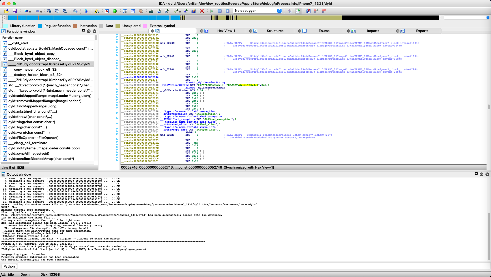

# dyld版本

## iPhone中dyld的版本

* iPhone中dyld的版本
  * 概述
    * 导出`iPhone`中`/usr/lib/dyld`，然后用工具（`IDA`、`rabin2`、`jtool2`等）分析出`_dyldVersionString`（和`_dyldVersionNumber`）中的版本号（字符串）

### 举例1

#### iPhone11

`iPhone11`中的`dyld`：

* /usr/lib/dyld

想要知道：dyld的版本号

最后是：

（1）先是：根据源码

https://opensource.apple.com/source/dyld/dyld-433.5/include/mach-o/dyld_images.h

知道了其中有个：

`dyldVersion`，其中会指向C字符串，其中包含：`dyld-127.3`这种值，其中就表示版本是：`127.3`

（2）去导出此处`dyld`二进制后，用工具（`rabin2`、`jtool2`等）查看到symbol中，包含`dyldVersion`字样的有：

```bash
1883 0x0004ddb8 0x0004ddb8 LOCAL  FUNC 0        _dyldVersionString
1884 0x0004dde0 0x0004dde0 LOCAL  FUNC 0        _dyldVersionNumber
```

（3）去通过IDA分析二进制，而查看到：

* `_dyldVersionString`
    * 地址：`000000000004DDB8`
    * 值=字符串：`@(#)PROGRAM:dyld  PROJECT:dyld-932.4`

-》即可从：

* `dyld-932.4`

找到最终要的值：

* `dyld`的版本号：`932.4`

#### iPhone7

导出`iPhone7`中的：

```bash
iPhone7-1331:~ root# ls /usr/lib/dyld
/usr/lib/dyld*
iPhone7-1331:~ root# ls -lh /usr/lib/dyld
-rwxr-xr-x 1 root wheel 650K Apr 14  2018 /usr/lib/dyld*
```

到Mac中：

```bash
crifan@licrifandeMacBook-Pro  ~/dev/dev_root/iosReverse/AppleStore/debug/gProcessInfo/iPhone7_1331  scp root@192.168.2.6:/usr/lib/dyld dyld
dyld                                                                                                              100%  650KB   6.5MB/s   00:00
 crifan@licrifandeMacBook-Pro  ~/dev/dev_root/iosReverse/AppleStore/debug/gProcessInfo/iPhone7_1331  ll
total 1304
-rwxr-xr-x  1 crifan  staff   650K  1 13 22:58 dyld
```

去导出symbol：

```bash
crifan@licrifandeMacBook-Pro  ~/dev/dev_root/iosReverse/AppleStore/debug/gProcessInfo/iPhone7_1331  rabin2 -s dyld > dyld_rabin2_s_symbols.txt
Stack exhaustion prevented
Stack exhaustion prevented
Stack exhaustion prevented
Stack exhaustion prevented
Stack exhaustion prevented
Stack exhaustion prevented
 crifan@licrifandeMacBook-Pro  ~/dev/dev_root/iosReverse/AppleStore/debug/gProcessInfo/iPhone7_1331  jtool2 -S dyld > dyld_jtool2_S_symbol.txt
 crifan@licrifandeMacBook-Pro  ~/dev/dev_root/iosReverse/AppleStore/debug/gProcessInfo/iPhone7_1331  ll
total 2512
-rwxr-xr-x  1 crifan  staff   650K  1 13 22:58 dyld
-rw-r--r--  1 crifan  staff   186K  1 13 22:59 dyld_jtool2_S_symbol.txt
-rw-r--r--  1 crifan  staff   412K  1 13 22:59 dyld_rabin2_s_symbols.txt
```

然后再去：搜dyldVersion

`/Users/crifan/dev/dev_root/iosReverse/AppleStore/debug/gProcessInfo/iPhone7_1331/dyld_rabin2_s_symbols.txt`

```bash
[Symbols]


nth  paddr      vaddr      bind   type size lib name
――――――――――――――――――――――――――――――――――――――――――――――――――――
0    0x0000e788 0x0000e788 GLOBAL FUNC 0        __dyld_debugger_notification
1    0x00052770 0x00052770 GLOBAL FUNC 0        _dyldVersionNumber
2    0x00052748 0x00052748 GLOBAL FUNC 0        _dyldVersionString
3    0x00068000 0x00068000 GLOBAL FUNC 0        _dyld_all_image_infos
4    0x00069180 0x00069180 GLOBAL FUNC 0        _error_string
5    0x00001000 0x00001000 LOCAL  FUNC 0        __dyld_start
...
```

->

* `_dyldVersionNumber`: `0x00052770`
* `_dyldVersionString`: `0x00052748`

再去用IDA查看版本号：

* `0x00052748`



```asm
__const:0000000000052748                 EXPORT _dyldVersionString
__const:0000000000052748 _dyldVersionString DCB "@(#)PROGRAM:dyld  PROJECT:dyld-733.3.1",0xA,0
__const:0000000000052770                 EXPORT _dyldVersionNumber
__const:0000000000052770 _dyldVersionNumber DCB 0x66 ; f
__const:0000000000052771                 DCB 0x66 ; f
__const:0000000000052772                 DCB 0x66 ; f
__const:0000000000052773                 DCB 0x66 ; f
__const:0000000000052774                 DCB 0x66 ; f
__const:0000000000052775                 DCB 0xEA
__const:0000000000052776                 DCB 0x86
__const:0000000000052777                 DCB 0x40 ; @
__const:0000000000052778 ; `typeinfo name for'std::exception
__const:0000000000052778 __ZTSSt9exception DCB "St9exception",0
```

->

* `_dyldVersionString`
  * `@(#)PROGRAM:dyld  PROJECT:dyld-733.3.1`

-> `dyld-733.3.1`

*  dyld版本号：`733.3.1`

### 或许相关

当前（Mac或iPhone中）的dyld的版本

-> 或许是：dyld，就是ld？

-> 如果是，则

`ld -v`可以查看版本：

举例：

```bash
➜  ~ ld -v
@(#)PROGRAM:ld  PROJECT:ld64-711
BUILD 18:11:15 Aug  3 2021
configured to support archs: armv6 armv7 armv7s arm64 arm64e arm64_32 i386 x86_64 x86_64h armv6m armv7k armv7m armv7em
LTO support using: LLVM version 13.0.0, (clang-1300.0.29.3) (static support for 27, runtime is 27)
TAPI support using: Apple TAPI version 13.0.0 (tapi-1300.0.6.5)
```

其中，`ld64-711`中的`711`，好像就是：`dyld`的版本
