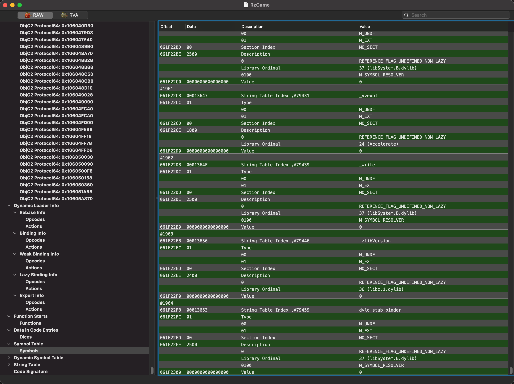
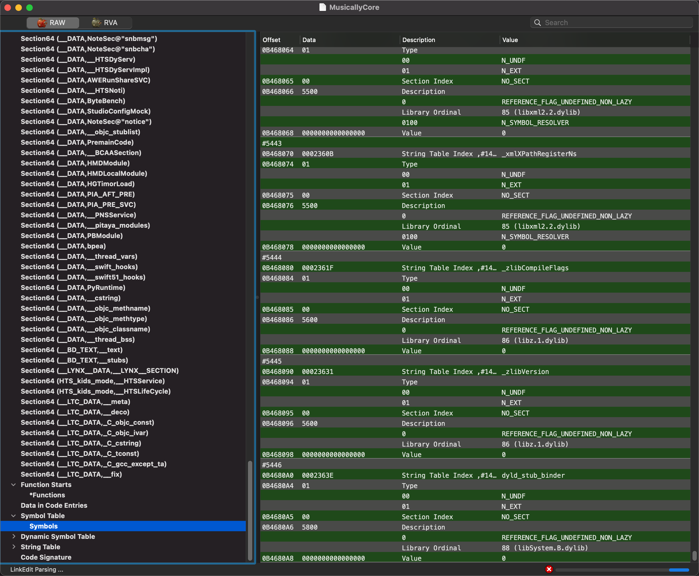
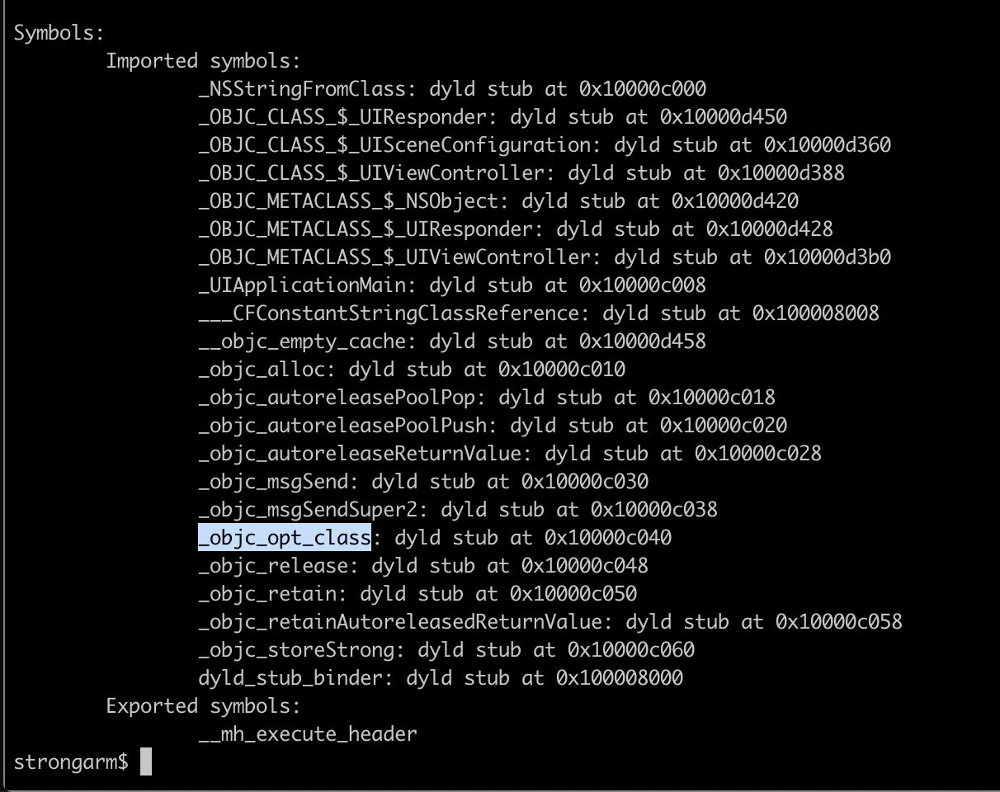

# dyld_stub_binder

* 代码实现在
  * [dyld_stub_binder.s](https://opensource.apple.com/source/dyld/dyld-421.1/src/dyld_stub_binder.s.auto.html)
  * [dyld/src/dyld_stub_binder.s at master · opensource-apple/dyld](https://github.com/opensource-apple/dyld/blob/master/src/dyld_stub_binder.s)

## 反汇编代码

```asm
libdyld.dylib`dyld_stub_binder:
->  0x18d122dc0 <+0>:   stp    x29, x30, [sp, #-0x10]!
    0x18d122dc4 <+4>:   mov    x29, sp
    0x18d122dc8 <+8>:   sub    sp, sp, #0xf0             ; =0xf0 
    0x18d122dcc <+12>:  stp    x0, x1, [x29, #-0x10]
    0x18d122dd0 <+16>:  stp    x2, x3, [x29, #-0x20]
    0x18d122dd4 <+20>:  stp    x4, x5, [x29, #-0x30]
    0x18d122dd8 <+24>:  stp    x6, x7, [x29, #-0x40]
    0x18d122ddc <+28>:  stp    x8, x9, [x29, #-0x50]
    0x18d122de0 <+32>:  stp    q0, q1, [x29, #-0x80]
    0x18d122de4 <+36>:  stp    q2, q3, [x29, #-0xa0]
    0x18d122de8 <+40>:  stp    q4, q5, [x29, #-0xc0]
    0x18d122dec <+44>:  stp    q6, q7, [x29, #-0xe0]
    0x18d122df0 <+48>:  ldr    x0, [x29, #0x18]
    0x18d122df4 <+52>:  ldr    x1, [x29, #0x10]
    0x18d122df8 <+56>:  bl     0x18d1246e4              ; _dyld_fast_stub_entry(void*, long)
    0x18d122dfc <+60>:  mov    x16, x0
    0x18d122e00 <+64>:  ldp    x0, x1, [x29, #-0x10]
    0x18d122e04 <+68>:  ldp    x2, x3, [x29, #-0x20]
    0x18d122e08 <+72>:  ldp    x4, x5, [x29, #-0x30]
    0x18d122e0c <+76>:  ldp    x6, x7, [x29, #-0x40]
    0x18d122e10 <+80>:  ldp    x8, x9, [x29, #-0x50]
    0x18d122e14 <+84>:  ldp    q0, q1, [x29, #-0x80]
    0x18d122e18 <+88>:  ldp    q2, q3, [x29, #-0xa0]
    0x18d122e1c <+92>:  ldp    q4, q5, [x29, #-0xc0]
    0x18d122e20 <+96>:  ldp    q6, q7, [x29, #-0xe0]
    0x18d122e24 <+100>: mov    sp, x29
    0x18d122e28 <+104>: ldp    x29, x30, [sp], #0x10
    0x18d122e2c <+108>: add    sp, sp, #0x10             ; =0x10 
    0x18d122e30 <+112>: br     x16
```

## 涉及到的例子

### nm a.out

```bash
$ nm a.out
0000000100002008 d __dyld_private
0000000100000000 T __mh_execute_header
0000000100000f50 T _main
         U _printf
         U dyld_stub_binder
```

### MachOView查看Undecember



### MachOView查看MusicallyCore



### nm Aweme

```bash
➜  Aweme.app nm Aweme
                 U __dyld_register_func_for_add_image
                 U _abort
                 U _awemeMain
                 U _dispatch_once_f
                 U _dlsym
                 U _free
                 U _getsectiondata
                 U _malloc
                 U _memcmp
                 U _memmove
                 U _objc_getClass
                 U _objc_lookUpClass
                 U _objc_setHook_getClass
                 U _posix_memalign
                 U _pthread_mutex_init
                 U _pthread_mutex_lock
                 U _pthread_mutex_unlock
                 U _realloc
                 U _strcmp
                 U _strlen
                 U dyld_stub_binder
```

和：

```bash
➜  Aweme.app nm -um Aweme
                 (undefined) external __dyld_register_func_for_add_image (from libSystem)
                 (undefined) external _abort (from libSystem)
                 (undefined) external _awemeMain (from AwemeCore)
                 (undefined) external _dispatch_once_f (from libSystem)
                 (undefined) external _dlsym (from libSystem)
                 (undefined) external _free (from libSystem)
                 (undefined) external _getsectiondata (from libSystem)
                 (undefined) external _malloc (from libSystem)
                 (undefined) external _memcmp (from libSystem)
                 (undefined) external _memmove (from libSystem)
                 (undefined) external _objc_getClass (from libobjc)
                 (undefined) external _objc_lookUpClass (from libobjc)
                 (undefined) weak external _objc_setHook_getClass (from libobjc)
                 (undefined) external _posix_memalign (from libSystem)
                 (undefined) external _pthread_mutex_init (from libSystem)
                 (undefined) external _pthread_mutex_lock (from libSystem)
                 (undefined) external _pthread_mutex_unlock (from libSystem)
                 (undefined) external _realloc (from libSystem)
                 (undefined) external _strcmp (from libSystem)
                 (undefined) external _strlen (from libSystem)
                 (undefined) external dyld_stub_binder (from libSystem)
```

### AwemeCore

```bash
➜  AwemeCore rabin2 -i ../../../../已脱壳/v18.9.0/Payload/Aweme.app/Frameworks/AwemeCore.framework/AwemeCore > AwemeCore_rabin2_i.txt
```

->

`5028 0x00000000 NONE FUNC               dyld_stub_binder`

和nm输出结果一样：

```bash
➜  AwemeCore.framework nm AwemeCore > nm_AwemeCore.txt
...
                 U dyld_stub_binder
```

### AppleSRP.tbd

`/Users/crifan/dev/dev_src/ios_reverse/AppleOpenSource/githubRepo/xybp888/iOS-SDKs/iPhoneOS14.5.sdk/System/Library/PrivateFrameworks/AppleSRP.framework/AppleSRP.tbd`

```c
--- !tapi-tbd-v3
archs:                 [ armv7, armv7s, arm64, arm64e ]
platform:              ios
flags:                 [ flat_namespace ]
install-name:          /System/Library/PrivateFrameworks/AppleSRP.framework/AppleSRP
current-version:       1
compatibility-version: 1
exports:
  - archs:                [ armv7, armv7s, arm64, arm64e ]
    symbols:              [ _BigIntegerAdd, ...
undefineds:
  - archs:                [ armv7, armv7s, arm64, arm64e ]
    symbols:              [ _CCBigNumAdd, ... _strlen, dyld_stub_binder ]
```

### Some Symbols



### 杂项

> 该地址指向的是__la_symbol_ptr节，而该节最终都指向了dyld_stub_binder。

和：

> 其实际内容都指向了_TEXT.__stub_helper节，最终通过jumpq指令跳转到了dyld_stub_binder符号，即__got节中的Non_Lazy Symbol Pointer中的条目，该符号为一个函数，定义于dyld_stub_binder.S，由 dyld 提供。
> 
> dyld_stub_binder函数其大致逻辑是：内部会寻找锁调用符号的真实地址，并写入_la_symbol_ptr条目中，然后跳转到真实地址执行；

和：

  ```asm
  __stub_helper:000000010000A394                 LDR             X16, =dyld_stub_binder
  __stub_helper:000000010000A398                 BR              X16     ; dyld_stub_binder
  ```
> 随后就会调用dyld_stub_binder函数进行符号绑定，这也是一个外部符号。当然你可能会说这样的话不就死循环了吗？其实不是，这个符号并不是lazy的即在初始化过程中就确定了地址。这里dyld_stub_binder的代码如下
  ```asm
  libdyld.dylib`dyld_stub_binder:
  ->  0x181bccb64 <+0>:   stp    x29, x30, [sp, #-0x10]!
  ...
  ```
* 接着就是去调用dyld_stub_binder函数进行符号绑定，第一次找到该符号地址以后直接返回给调用处，并且将__DATA,__la_symbol_ptr中objc_msgSend的指针值更改为找到的符号地址。这样下一次就不会跳转到__TEXT,__stub_helper里面，而是直接跳转到正确的函数地址。
  ```asm
  __stub_helper:000000010000A384 ; Segment type: Pure code
  __stub_helper:000000010000A384                 AREA __stub_helper, CODE, READWRITE
  __stub_helper:000000010000A384                 ; ORG 0x10000A384
  __stub_helper:000000010000A384                 CODE64
  __stub_helper:000000010000A384                 ADR             X17, off_10000C030
  __stub_helper:000000010000A388                 NOP
  __stub_helper:000000010000A38C                 STP             X16, X17, [SP,#-0x10]!
  __stub_helper:000000010000A390                 NOP
  __stub_helper:000000010000A394                 LDR             X16, =dyld_stub_binder
  __stub_helper:000000010000A398                 BR              X16     ; dyld_stub_binder
  ```
