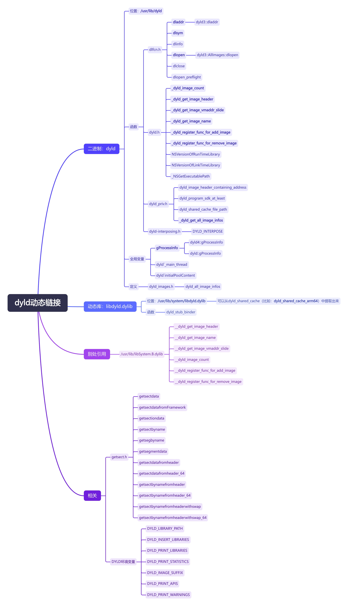
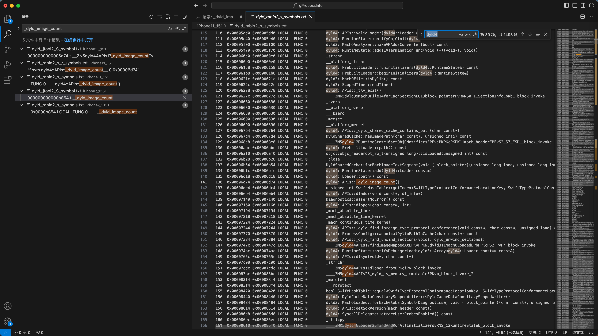
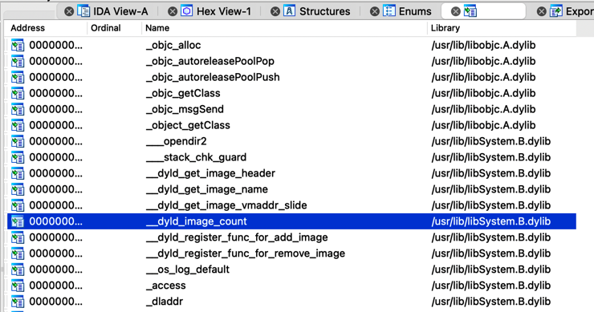

# dyld函数概览

## 图

* dyld动态链接
  * 在线查看
    * [dyld动态链接| ProcessOn免费在线作图](https://www.processon.com/view/link/67170fe8b61b2f442a678ae8)
  * 本地浏览
    * 

## 文字

* `dyld`
  * 是什么：二进制文件=工具
  * 位置
    * `/cores/dyld`
    * `/usr/lib/dyld`
  * 内部结构
    * section
      * `dyld.__TEXT.__text`
  * 函数
    * 概述
      * 包括绝大多数dyld相关的函数
        * 举例
          * `iPhone11_151/dyld_rabin2_s_symbols.txt`
            * 
    * dlfcn.h
      * `dladdr`
        * `dyld3::dladdr`
      * `dlsym`
      * `dlinfo`
      * `dlopen`
        * `dyld3::AllImages::dlopen`
      * `dlclose`
      * `dlopen_preflight`
    * dyld.h
      * `_dyld_image_count`
      * `_dyld_get_image_header`
      * `_dyld_get_image_vmaddr_slide`
      * `_dyld_get_image_name`
      * `_dyld_register_func_for_add_image`
      * `_dyld_register_func_for_remove_image`
      * `NSVersionOfRunTimeLibrary`
      * `NSVersionOfLinkTimeLibrary`
      * `_NSGetExecutablePath`
    * dyld_priv.h
      * `dyld_image_header_containing_address`
      * `dyld_program_sdk_at_least`
      * `dyld_shared_cache_file_path`
      * `_dyld_get_all_image_infos`
    * dyld-interposing.h
      * `DYLD_INTERPOSE`
    * 其他
      * dyld类的函数
        * `dyld::notifySingle`
        * `dyld::initializeMainExecutable`
        * `dyld::_main`
        * `dyld::registerAddCallback`
      * ImageLoaderMachO类的函数
        * `ImageLoaderMachO::doModInitFunctions`
        * `ImageLoaderMachO::doInitialization`
      * ImageLoader类的函数
        * `ImageLoader::recursiveInitialization`
        * `ImageLoader::processInitializers`
        * `ImageLoader::runInitializers`
      * dyldbootstrap类的函数
        * `dyldbootstrap::start`
      * dyld3类的函数
        * `dyld3::OverflowSafeArray`
        * `dyld3::MachOFile::forEachLoadCommand`
        * `dyld3::MachOFile::getUuid`
      * dyld4类的函数
        * `dyld4::RuntimeState::initialize`
        * `dyld4::APIs::_libdyld_initialize`
  * 全局变量
    * ```dyld`_main_thread```
    * ```dyld`initialPoolContent```
    * `gProcessInfo`
      * `dyld4::gProcessInfo`
      * `dyld::gProcessInfo`
  * 相关定义
    * dyld_images.h
      * `dyld_all_image_infos`
  * ->别处引用
    * 下划线开头的函数：`_xxx`
      * 举例
        * `/usr/lib/libSystem.B.dylib`
          * 
            * `__dyld_get_image_header`
            * `__dyld_get_image_name`
            * `__dyld_get_image_vmaddr_slide`
            * `__dyld_image_count`
            * `__dyld_register_func_for_add_image`
            * `__dyld_register_func_for_remove_image`
* `libdyld.dylib`
  * 是什么：动态库
  * 位置
    * `/usr/lib/system/libdyld.dylib`
  * 函数
    * `dyld_stub_binder`
* 相关
  * getsect.h
    * `getsectdata`
    * `getsectdatafromFramework`
    * `getsectiondata`
    * `getsectbyname`
    * `getsegbyname`
    * `getsegmentdata`
    * `getsectdatafromheader`
      * `getsectdatafromheader_64`
    * `getsectbynamefromheader`
      * `getsectbynamefromheader_64`
    * `getsectbynamefromheaderwithswap`
      * `getsectbynamefromheaderwithswap_64`
  * DYLD环境变量
    * `DYLD_LIBRARY_PATH`
    * `DYLD_INSERT_LIBRARIES`
    * `DYLD_PRINT_LIBRARIES`
    * `DYLD_PRINT_STATISTICS`
    * `DYLD_IMAGE_SUFFIX`
    * `DYLD_PRINT_APIS`
    * `DYLD_PRINT_WARNINGS`
