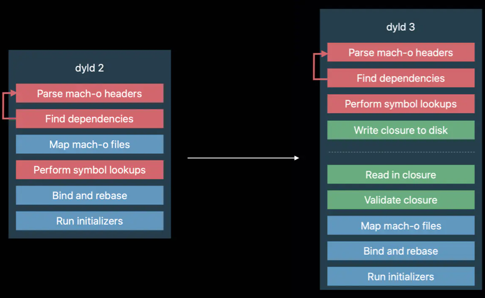

# dyld库的版本和架构

* dyld库的版本和架构
  * 历史版本
    * 最新：`dyld4`
    * 之前：`dyld3`
    * 更早：`dyld2`
  * 对比
    * dyld2 vs dyld3
      * 图
        * 
      * 文字
        * dyld2 和 dyld3 的主要变化体现在源码上就是 dyld-400 和 dyld-600的版本，比如较低版本的模拟器采用的仍然是 dyld-433 的版本，而 iOS12 之后的真机基本上都采用 dyld-655 以后的版本
        * dyld3 在很早就引入，但是一开始只用于 Apple 相关的 App 或者系统库（库还是 App 有待考究）。而在 iOS13 之后，dyld3 正式替代 dyld2，用于加载所有的 App
        * dyld-433 版本的源码是比较纯粹 dyld2 的逻辑，而 dyld-655 就能看到很多 dyld3 的优化代码了。dyld3 在流程上有所改进，且源码上也有了很多变化，但是 dyld2 仍然是基础，源码的参考价值仍然比较高，因此本文采用 dyld-433.5 的版本研究 dyld2 的基础流程。偶尔也会对比 dyld-655.1.1 和 dyld-733.6的版本  
  * 最新：`dyld4`
    * 源码
      * https://github.com/apple-oss-distributions/dyld
    * dyld模型
      * `dyld`：包括绝大多数运行时的代码逻辑
      * `libdyld.dylib`：代码量较少，瘦身设计
    * 源码结构
      * [dyld/doc/dyld4.md at main · apple-oss-distributions/dyld](https://github.com/apple-oss-distributions/dyld/blob/main/doc/dyld4.md)
        * `dyld/` - the code that contributes to `dyld`
        * `libdyld/` - the code that contibutes to `libdyld.dylib`
        * `cache-builder/` - code for tools such as `dyld_usage`, `dyld_info`, `dyld_shared_cache_builder`, etc
        * `other-tools/` - code for tools such as `dyld_usage`, `dyld_info`, `dyld_shared_cache_builder`, etc
        * `common/` - common code shared between `dyld` and `cache-builder`
        * `include/` - public headers
        * `testing/` - everything used to test `dyld`
        * `doc/` - man pages and other documentation
        * `configs/` - xcconfig files used by targets
        * `build-scripts/` - shell script phase scripts
