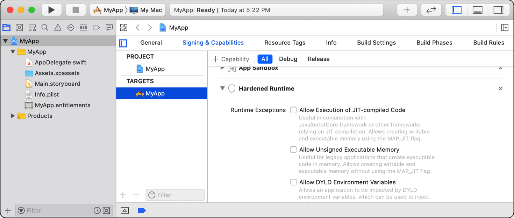

# 相关环境变量

* dyld相关环境变量
  * `DYLD_LIBRARY_PATH`
  * `DYLD_FRAMEWORK_PATH`
  * 
  * `DYLD_PRINT_STATISTICS`
  * `DYLD_PRINT_WARNINGS`
    * 注：文档中没标注，但实际存在
  * `DYLD_PRINT_LIBRARIES`
  * 
  * `DYLD_INSERT_LIBRARIES`
  * `DYLD_IMAGE_SUFFIX`
  * 
  * `DYLD_INTERPOSE`

## 代码

尝试去基于普通的iOS的app：

* 旧：ShowSysInfo
* 新：[crifan/iOSJailbreakDetection: iOS的ObjC的app，实现iOS越狱检测](https://github.com/crifan/iOSJailbreakDetection)
  * 相关：[crifan/iOSBypassJailbreak: 越狱iOS的hook插件，实现反越狱检测](https://github.com/crifan/iOSBypassJailbreak)

写代码去检测：

```objc
    const char* dyldEnvList[] = {
        "DYLD_FRAMEWORK_PATH",
        "DYLD_FALLBACK_FRAMEWORK_PATH",
        "DYLD_VERSIONED_FRAMEWORK_PATH",
        "DYLD_LIBRARY_PATH",
        "DYLD_FALLBACK_LIBRARY_PATH",
        "DYLD_VERSIONED_LIBRARY_PATH",
        "DYLD_ROOT_PATH",
        "DYLD_SHARED_REGION",
        "DYLD_INSERT_LIBRARIES",
        "DYLD_FORCE_FLAT_NAMESPACE",
        "DYLD_IMAGE_SUFFIX",
        "DYLD_PRINT_OPTS",
        "DYLD_PRINT_ENV",
        "DYLD_PRINT_LIBRARIES",
        "DYLD_PRINT_LIBRARIES_POST_LAUNCH",
        "DYLD_BIND_AT_LAUNCH",
        "DYLD_NO_FIX_PREBINDING",
        "DYLD_DISABLE_DOFS",
        "DYLD_PRINT_APIS",
        "DYLD_PRINT_BINDINGS",
        "DYLD_PRINT_INITIALIZERS",
        "DYLD_PRINT_REBASINGS",
        "DYLD_PRINT_SEGMENTS",
        "DYLD_PRINT_STATISTICS",
        "DYLD_PRINT_DOFS",
        "DYLD_PRINT_RPATHS",
        "DYLD_SHARED_CACHE_DIR",
        "DYLD_SHARED_CACHE_DONT_VALIDATE",
    };
    const int dyldEnvListLen = sizeof(dyldEnvList)/sizeof(const char *);

    for(int curIdx = 0; curIdx < dyldEnvListLen; curIdx++){
        const char* curDyldEnv = dyldEnvList[curIdx];
        char* curEnvRet = getenv(curDyldEnv);
        NSLog(@"dyld: [%d] %s -> %s", curIdx, curDyldEnv, curEnvRet);
    }
```

输出：

```bash
2021-12-08 23:23:38.766182+0800 ShowSysInfo[2528:70589] dyld: [0] DYLD_FRAMEWORK_PATH -> (null)
2021-12-08 23:23:39.686564+0800 ShowSysInfo[2528:70589] dyld: [1] DYLD_FALLBACK_FRAMEWORK_PATH -> (null)
2021-12-08 23:23:40.358640+0800 ShowSysInfo[2528:70589] dyld: [2] DYLD_VERSIONED_FRAMEWORK_PATH -> (null)
2021-12-08 23:23:40.903442+0800 ShowSysInfo[2528:70589] dyld: [3] DYLD_LIBRARY_PATH -> /usr/lib/system/introspection
2021-12-08 23:23:44.232044+0800 ShowSysInfo[2528:70589] dyld: [4] DYLD_FALLBACK_LIBRARY_PATH -> (null)
2021-12-08 23:23:44.232767+0800 ShowSysInfo[2528:70589] dyld: [5] DYLD_VERSIONED_LIBRARY_PATH -> (null)
2021-12-08 23:23:44.233289+0800 ShowSysInfo[2528:70589] dyld: [6] DYLD_ROOT_PATH -> (null)
2021-12-08 23:23:44.233876+0800 ShowSysInfo[2528:70589] dyld: [7] DYLD_SHARED_REGION -> (null)
2021-12-08 23:23:44.236542+0800 ShowSysInfo[2528:70589] dyld: [8] DYLD_INSERT_LIBRARIES -> (null)
2021-12-08 23:23:44.237126+0800 ShowSysInfo[2528:70589] dyld: [9] DYLD_FORCE_FLAT_NAMESPACE -> (null)
2021-12-08 23:23:44.237587+0800 ShowSysInfo[2528:70589] dyld: [10] DYLD_IMAGE_SUFFIX -> (null)
2021-12-08 23:23:44.239169+0800 ShowSysInfo[2528:70589] dyld: [11] DYLD_PRINT_OPTS -> (null)
2021-12-08 23:23:44.239466+0800 ShowSysInfo[2528:70589] dyld: [12] DYLD_PRINT_ENV -> (null)
2021-12-08 23:23:44.239743+0800 ShowSysInfo[2528:70589] dyld: [13] DYLD_PRINT_LIBRARIES -> (null)
2021-12-08 23:23:44.240183+0800 ShowSysInfo[2528:70589] dyld: [14] DYLD_PRINT_LIBRARIES_POST_LAUNCH -> (null)
2021-12-08 23:23:44.240731+0800 ShowSysInfo[2528:70589] dyld: [15] DYLD_BIND_AT_LAUNCH -> (null)
2021-12-08 23:23:44.242577+0800 ShowSysInfo[2528:70589] dyld: [16] DYLD_NO_FIX_PREBINDING -> (null)
2021-12-08 23:23:44.242877+0800 ShowSysInfo[2528:70589] dyld: [17] DYLD_DISABLE_DOFS -> (null)
2021-12-08 23:23:44.243159+0800 ShowSysInfo[2528:70589] dyld: [18] DYLD_PRINT_APIS -> (null)
2021-12-08 23:23:44.244455+0800 ShowSysInfo[2528:70589] dyld: [19] DYLD_PRINT_BINDINGS -> (null)
2021-12-08 23:23:44.244745+0800 ShowSysInfo[2528:70589] dyld: [20] DYLD_PRINT_INITIALIZERS -> (null)
2021-12-08 23:23:44.245073+0800 ShowSysInfo[2528:70589] dyld: [21] DYLD_PRINT_REBASINGS -> (null)
2021-12-08 23:23:44.246477+0800 ShowSysInfo[2528:70589] dyld: [22] DYLD_PRINT_SEGMENTS -> (null)
2021-12-08 23:23:44.246814+0800 ShowSysInfo[2528:70589] dyld: [23] DYLD_PRINT_STATISTICS -> (null)
2021-12-08 23:23:44.247119+0800 ShowSysInfo[2528:70589] dyld: [24] DYLD_PRINT_DOFS -> (null)
2021-12-08 23:23:44.247715+0800 ShowSysInfo[2528:70589] dyld: [25] DYLD_PRINT_RPATHS -> (null)
2021-12-08 23:23:44.248359+0800 ShowSysInfo[2528:70589] dyld: [26] DYLD_SHARED_CACHE_DIR -> (null)
2021-12-08 23:23:44.248641+0800 ShowSysInfo[2528:70589] dyld: [27] DYLD_SHARED_CACHE_DONT_VALIDATE -> (null)
```

其中只有一个不是NULL的：

`[3] DYLD_LIBRARY_PATH -> /usr/lib/system/introspection`

但是却又和越狱无关 -》无法利用来去做越狱检测

以及相关的：

### hook函数getenv

```c
/*==============================================================================
 Hook: getenv(DYLD_INSERT_LIBRARIES)
==============================================================================*/

char * getenv(const char* name);
const char* DYLD_INSERT_LIBRARIES = "DYLD_INSERT_LIBRARIES";

%hookf(char *, getenv, const char* name){
    // dyldInfo("name=%s", name);
//    os_log(OS_LOG_DEFAULT, "getenv: name=%s", name);
//    NSLog(@"getenv name");
    
    if (strStartsWith(name, "DYLD_")){
        dyldInfo("getenv name=%s", name);
    }
    
    // if(0 == strcmp(name, DYLD_INSERT_LIBRARIES)){
    //     return NULL;
    // } else {
    //     return %orig;
    // }

//    char* getenvRetStr = %orig(name);
    char* getenvRetStr = %orig;
    if(0 == strcmp(name, DYLD_INSERT_LIBRARIES)){
        iosLogInfo("name=%s -> getenvRetStr=%{public}s", name, getenvRetStr);
        return NULL;
    } else {
        if (strStartsWith(name, "DYLD_")){
            iosLogInfo("name=%s -> getenvRetStr=%{public}s", name, getenvRetStr);
            return getenvRetStr;
        } else {
            return getenvRetStr;
        }
    }
}
```

输出：

```bash
默认    09:12:46.358793+0800    Aweme    hook_misc.xm getenv: DYLD_ name=DYLD_INSERT_LIBRARIES

默认    09:12:48.223953+0800    Aweme    hook_misc.xm getenv: DYLD_ name=DYLD_IMAGE_SUFFIX
默认    09:12:48.223999+0800    Aweme    hook_misc.xm getenv: name=DYLD_IMAGE_SUFFIX -> retEntValue=(null)
```

## 使用举例

### Xcode中`Allow DYLD Environment Variables`

sandbox沙箱 harden runtime强化运行时 -》 

* `Xcode`->`Targets`->`Signing & Capabilities`->`Hardened Runtime`
  * `Allow DYLD Environment Variables`
    * 作用
      * A Boolean value that indicates whether the app may be affected by dynamic linker environment variables, which you can use to inject code into your app’s process
    * 对应的key：`com.apple.security.cs.allow-dyld-environment-variables`
    * 效果
      * 

### Xcode中相关参数

* `LD_DYLIB_INSTALL_NAME`
  ```json
  {
    "displayName": "Dynamic Library Install Name",
    "description": "Sets an internal `install path` (`LC_ID_DYLIB`) in a dynamic library. Any clients linked against the library will record that path as the way `dyld` should locate this library. If this option is not specified, then the `-o` path will be used. This setting is ignored when building any product other than a dynamic library. See [Dynamic Library Programming Topics](https://developer.apple.com/library/content/documentation/DeveloperTools/Conceptual/DynamicLibraries/000-Introduction/Introduction.html).",
    "name": "LD_DYLIB_INSTALL_NAME"
  },
  ```
* `LD_RUNPATH_SEARCH_PATHS`
  ```json
  {
    "displayName": "Runpath Search Paths",
    "description": "This is a list of paths to be added to the `runpath` search path list for the image being created. At runtime, `dyld` uses the `runpath` when searching for dylibs whose load path begins with `@rpath/`. See [Dynamic Library Programming Topics](https://developer.apple.com/library/content/documentation/DeveloperTools/Conceptual/DynamicLibraries/000-Introduction/Introduction.html).",
    "name": "LD_RUNPATH_SEARCH_PATHS"
  },
  ```
