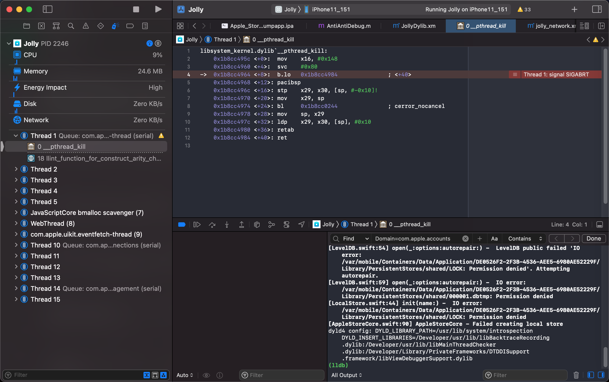
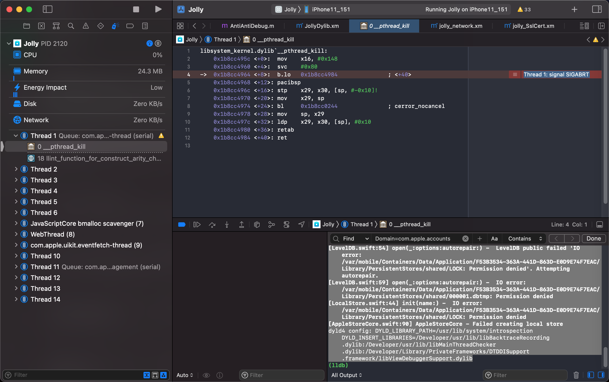

# DYLD_INSERT_LIBRARIES

下面整理涉及到`DYLD_INSERT_LIBRARIES`的相关内容：

## AppleStore

```bash
dyld4 config: ... DYLD_INSERT_LIBRARIES=/Developer/usr/lib/libBacktraceRecording.dylib:/Developer/usr/lib/libMainThreadChecker.dylib:/Developer/Library/PrivateFrameworks/DTDDISupport.framework/libViewDebuggerSupport.dylib
```

## 砸壳Apple Store

去用刚编译好的arm64的dumpdecrypted.dylib去砸壳Apple Store，结果报错：

```bash
iPhone11-151:~/dev root# DYLD_INSERT_LIBRARIES=/var/usr/lib/dumpdecrypted.dylib /var/containers/Bundle/Application/E892C046-2A14-44BC-90A6-748BE3D84E8D/Apple\ Store.app/Apple\ Store
Killed: 9
```

## AppleStore砸壳：dumpapp.com网站



## AppleStore账号获取失败：替换Data目录



```bash
[AppleStoreCore.swift:90] AppleStoreCore - Failed creating local store
dyld4 config: ... DYLD_INSERT_LIBRARIES=/Developer/usr/lib/libBacktraceRecording.dylib:/Developer/usr/lib/libMainThreadChecker.dylib:/Developer/Library/PrivateFrameworks/DTDDISupport.framework/libViewDebuggerSupport.dylib
```

## hook代码AKAnisetteProvisioningService

```bash
dyld4 config: DYLD_INSERT_LIBRARIES=/var/lib/TweakInject.dylib
*** Terminating app due to uncaught exception 'NSInvalidArgumentException', reason: '+[AKAnisetteProvisioningService fetchAnisetteDataAndProvisionIfNecessary:device:completion:]: unrecognized selector sent to class 0x104c9b100'
terminating with uncaught exception of type NSException
```

## MonkeyDev调试app不崩溃却卡死禁用断点始终停在Foundation的NSString的stringByAppendingString

```c
//    char* insertLibs = getenv("DYLD_INSERT_LIBRARIES");
```

## 别人提到的

[iOS 11.3.1上使用bfinject注入dylib后的问题 - 技能讨论 - 睿论坛 (iosre.com)](https://iosre.com/t/ios-1131%E4%B8%8A%E4%BD%BF%E7%94%A8bfinject%E6%B3%A8%E5%85%A5dylib%E5%90%8E%E7%9A%84%E9%97%AE%E9%A2%98/13278)

再多问一句，我挺想知道原理的，为什么针对iOS自己的daemon（比如installed）的tweak里面可以直接使用MSHookFunction，是不是越狱工具会自动帮你提权？我大概跟踪了一下tweak的加载流程，先是通过DYLD_INSERT_LIBRARIES加载tweakloader，然后tweakloader会根据bundleid去dlopen对应的tweak dylib。似乎这个过程中没看到哪里有帮你提权的操作。
