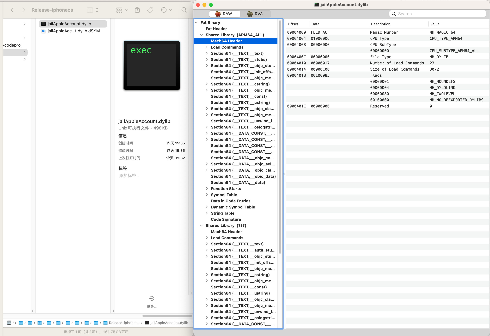
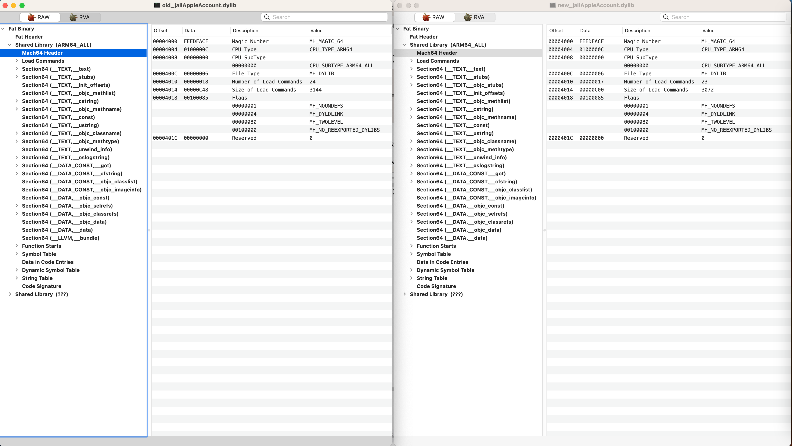
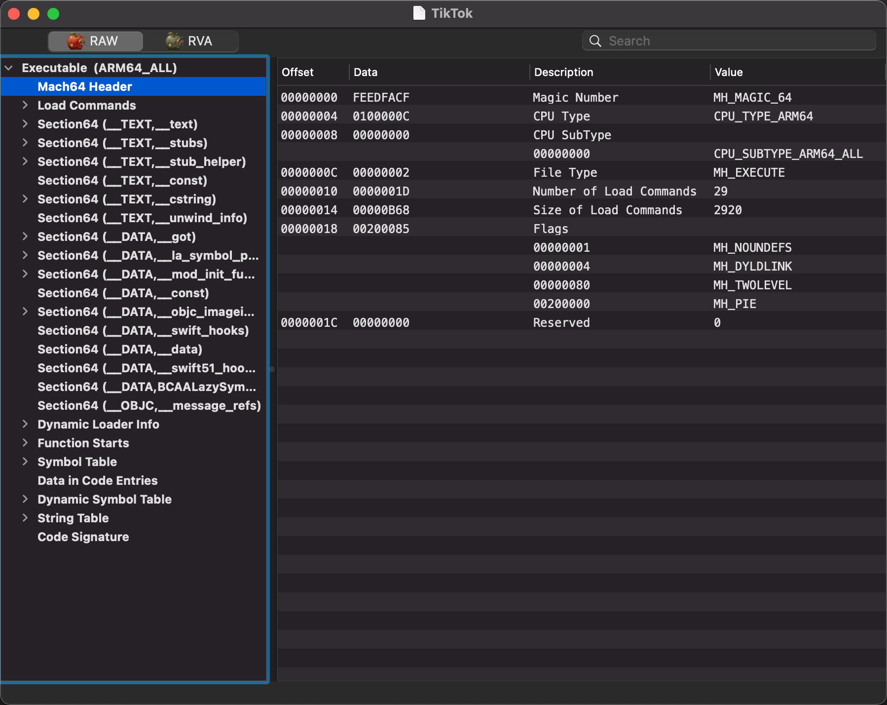

# 涉及地方

## Mach64 Header

### MachOView - some dylib





### MachOView - Tiktok



## LC = Load Commands

### class-dump

https://github.com/nygard/class-dump.git

* `Source/CDLoadCommand.m`

```c
- (NSString *)commandName;
{
    switch (self.cmd) {
        case LC_SEGMENT:               return @"LC_SEGMENT";
        case LC_SYMTAB:                return @"LC_SYMTAB";
        case LC_SYMSEG:                return @"LC_SYMSEG";
        case LC_THREAD:                return @"LC_THREAD";
        case LC_UNIXTHREAD:            return @"LC_UNIXTHREAD";
        case LC_LOADFVMLIB:            return @"LC_LOADFVMLIB";
        case LC_IDFVMLIB:              return @"LC_IDFVMLIB";
        case LC_IDENT:                 return @"LC_IDENT";
        case LC_FVMFILE:               return @"LC_FVMFILE";
        case LC_PREPAGE:               return @"LC_PREPAGE";
        case LC_DYSYMTAB:              return @"LC_DYSYMTAB";
        case LC_LOAD_DYLIB:            return @"LC_LOAD_DYLIB";
        case LC_ID_DYLIB:              return @"LC_ID_DYLIB";
        case LC_LOAD_DYLINKER:         return @"LC_LOAD_DYLINKER";
        case LC_ID_DYLINKER:           return @"LC_ID_DYLINKER";
        case LC_PREBOUND_DYLIB:        return @"LC_PREBOUND_DYLIB";
        case LC_ROUTINES:              return @"LC_ROUTINES";
        case LC_SUB_FRAMEWORK:         return @"LC_SUB_FRAMEWORK";
        case LC_SUB_UMBRELLA:          return @"LC_SUB_UMBRELLA";
        case LC_SUB_CLIENT:            return @"LC_SUB_CLIENT";
        case LC_SUB_LIBRARY:           return @"LC_SUB_LIBRARY";
        case LC_TWOLEVEL_HINTS:        return @"LC_TWOLEVEL_HINTS";
        case LC_PREBIND_CKSUM:         return @"LC_PREBIND_CKSUM";
            
        case LC_LOAD_WEAK_DYLIB:       return @"LC_LOAD_WEAK_DYLIB";
        case LC_SEGMENT_64:            return @"LC_SEGMENT_64";
        case LC_ROUTINES_64:           return @"LC_ROUTINES_64";
        case LC_UUID:                  return @"LC_UUID";
        case LC_RPATH:                 return @"LC_RPATH";
        case LC_CODE_SIGNATURE:        return @"LC_CODE_SIGNATURE";
        case LC_SEGMENT_SPLIT_INFO:    return @"LC_SEGMENT_SPLIT_INFO";
        case LC_REEXPORT_DYLIB:        return @"LC_REEXPORT_DYLIB";
        case LC_LAZY_LOAD_DYLIB:       return @"LC_LAZY_LOAD_DYLIB";
        case LC_ENCRYPTION_INFO:       return @"LC_ENCRYPTION_INFO";
        case LC_DYLD_INFO:             return @"LC_DYLD_INFO";
        case LC_DYLD_INFO_ONLY:        return @"LC_DYLD_INFO_ONLY";
        case LC_LOAD_UPWARD_DYLIB:     return @"LC_LOAD_UPWARD_DYLIB";
        case LC_VERSION_MIN_MACOSX:    return @"LC_VERSION_MIN_MACOSX";
        case LC_VERSION_MIN_IPHONEOS:  return @"LC_VERSION_MIN_IPHONEOS";
        case LC_FUNCTION_STARTS:       return @"LC_FUNCTION_STARTS";
        case LC_DYLD_ENVIRONMENT:      return @"LC_DYLD_ENVIRONMENT";

        case LC_LINKER_OPTION:            return @"LC_LINKER_OPTION";
        case LC_LINKER_OPTIMIZATION_HINT: return @"LC_LINKER_OPTIMIZATION_HINT";
        case LC_VERSION_MIN_TVOS:         return @"LC_VERSION_MIN_TVOS";
        case LC_VERSION_MIN_WATCHOS:      return @"LC_VERSION_MIN_WATCHOS";
        case LC_NOTE:                     return @"LC_NOTE";
        case LC_BUILD_VERSION:            return @"LC_BUILD_VERSION";

        default:
            break;
    }

    return [NSString stringWithFormat:@"0x%08x", [self cmd]];
}
```

### accountsd

```bash
LC 04: LC_SEGMENT_64              Mem: 0x10000c000-0x100018000    __LINKEDIT
LC 05: LC_DYLD_CHAINED_FIXUPS    
LC 06: LC_DYLD_EXPORTS_TRIE      
LC 07: LC_SYMTAB                 
LC 08: LC_DYSYMTAB               
        1 local symbols at index     0
        1 external symbols at index  1
       28 undefined symbols at index 2
       No TOC
       No modtab
       29 Indirect symbols at offset 0xc570
LC 09: LC_LOAD_DYLINKER          /usr/lib/dyld
LC 10: LC_UUID                   UUID: C7359973-734A-32BC-AABC-9410717E660B
```

### akd

```bash
LC 05: LC_DYLD_CHAINED_FIXUPS    
LC 06: LC_DYLD_EXPORTS_TRIE      
LC 07: LC_SYMTAB                 
LC 08: LC_DYSYMTAB               
        1 local symbols at index     0
        1 external symbols at index  1
      584 undefined symbols at index 2
       No TOC
       No modtab
      608 Indirect symbols at offset 0x130558
LC 09: LC_LOAD_DYLINKER          /usr/lib/dyld
```

### otool aweme

```bash
➜  Aweme.app otool -l Aweme

Load command 6
            cmd LC_DYLD_INFO_ONLY
        cmdsize 48
     rebase_off 49152
    rebase_size 16
       bind_off 49168
      bind_size 56
  weak_bind_off 0
 weak_bind_size 0
  lazy_bind_off 49224
 lazy_bind_size 416
     export_off 0
    export_size 0

Load command 9
          cmd LC_LOAD_DYLINKER
      cmdsize 32
         name /usr/lib/dyld (offset 12)
```
