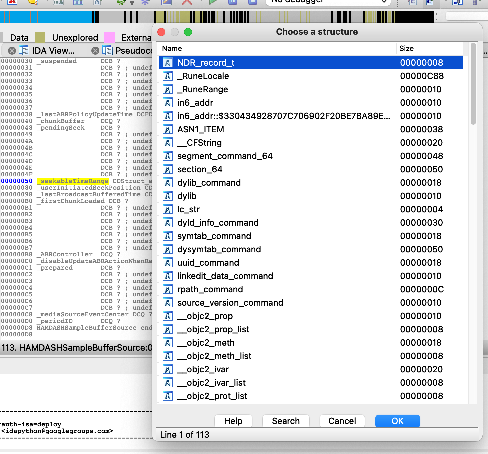
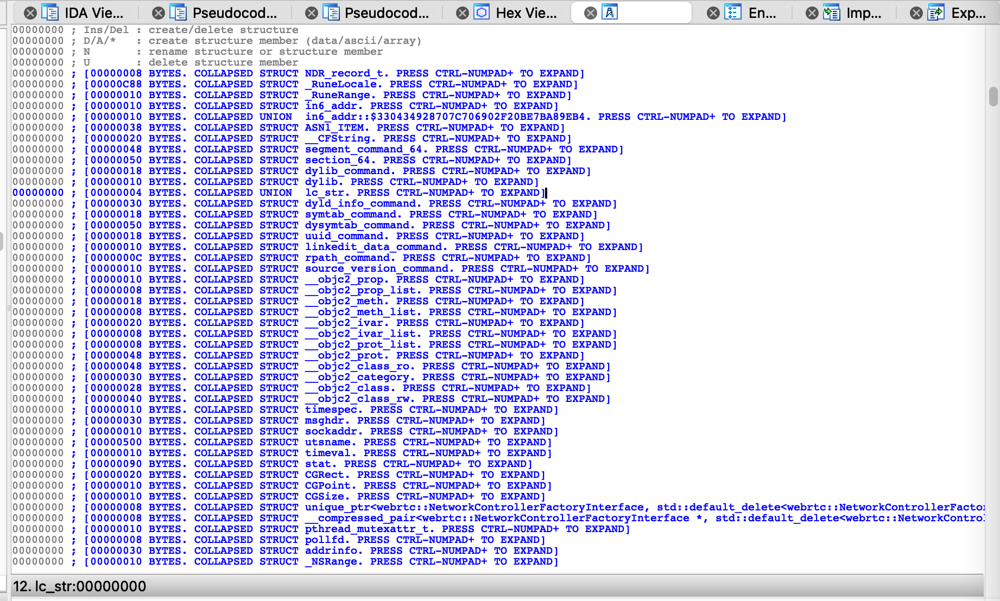
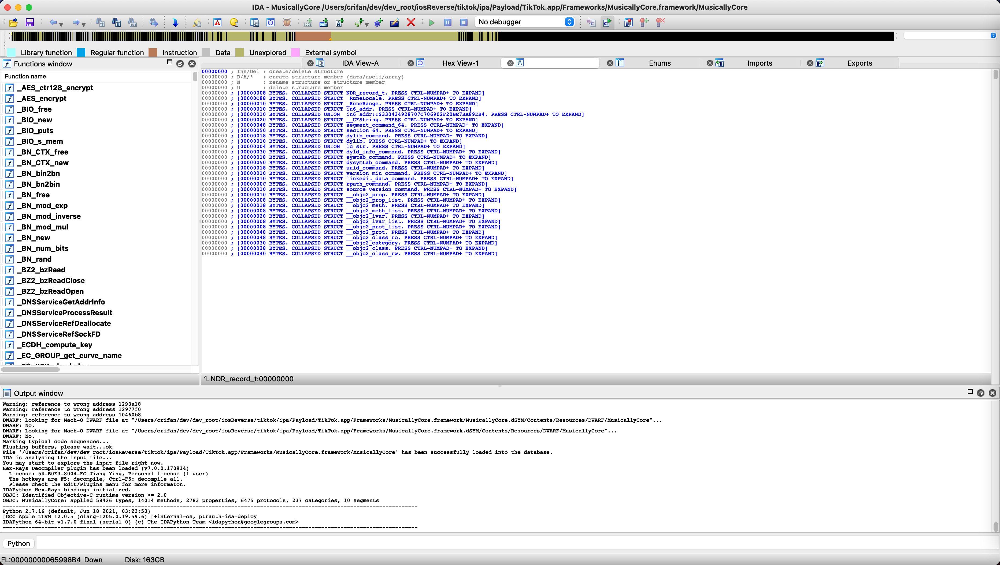
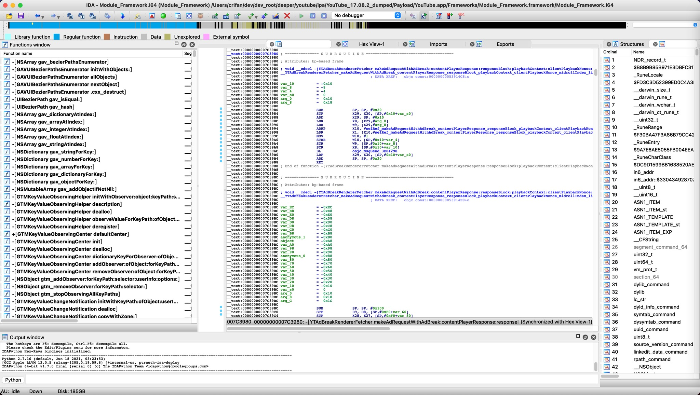

# dyld_info_command

* 定义

```c
struct dyld_info_command {
    uint32_t cmd;            /* LC_DYLD_INFO or LC_DYLD_INFO_ONLY */
    uint32_t cmdsize;        /* sizeof(struct dyld_info_command) */

    uint32_t rebase_off;     /* file offset to rebase info  */
    uint32_t rebase_size;    /* size of rebase info   */

    uint32_t bind_off;       /* file offset to binding info   */
    uint32_t bind_size;      /* size of binding info  */

    uint32_t weak_bind_off;  /* file offset to weak binding info   */
    uint32_t weak_bind_size; /* size of weak binding info  */

    uint32_t lazy_bind_off;  /* file offset to lazy binding info */
    uint32_t lazy_bind_size; /* size of lazy binding infs */

    uint32_t export_off;     /* file offset to lazy binding info */
    uint32_t export_size;    /* size of lazy binding infs */
};
```

## 涉及的地方

### IDA





### MusicallyCore



### YouTube


